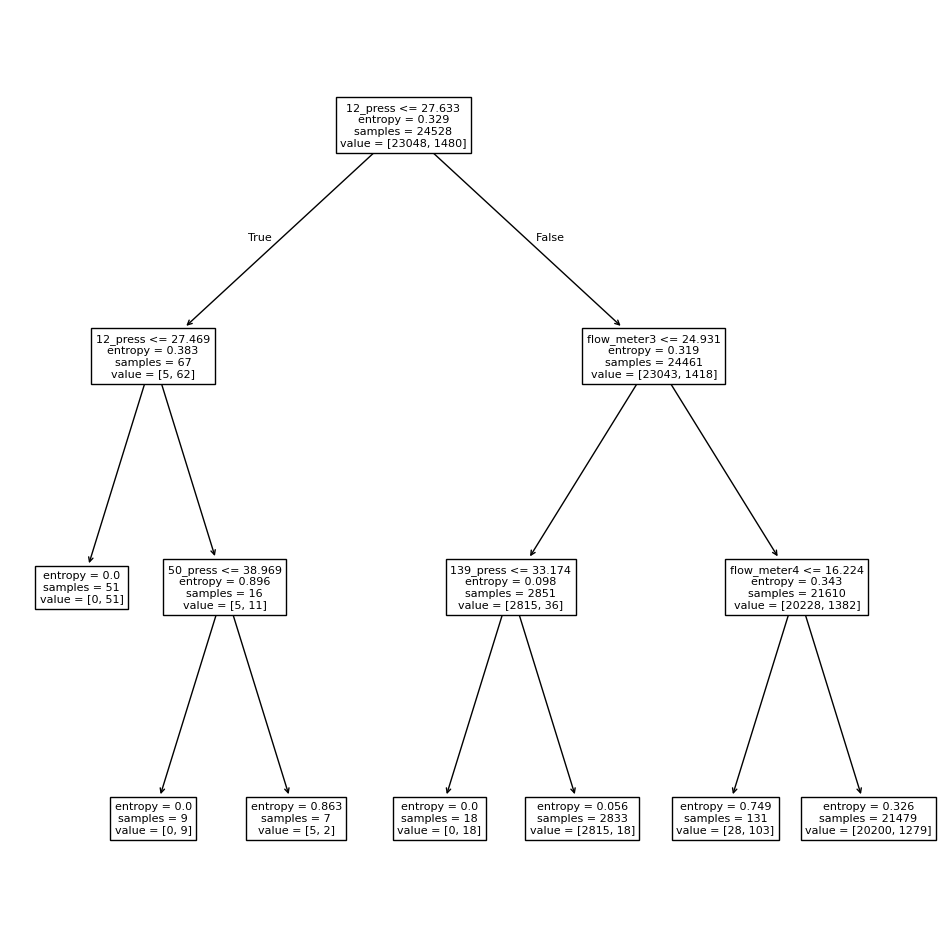
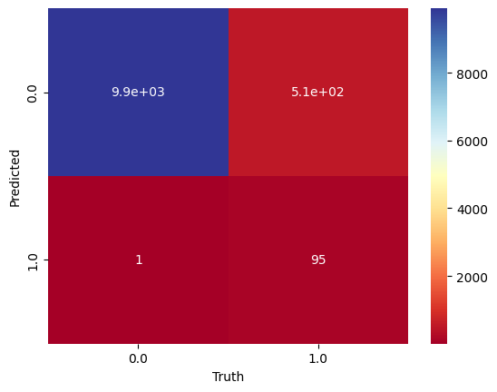

# Detailed Statistical and Machine Learning Analysis
**Authors:** Mateo H. Sanchez, Jose A. Calvetty, Milena R. de Sousa

**Dataset:** [Generated Datasets for Burst Detection in Water Distribution Systems](https://github.com/ArieleZanfei/generated-datasets-for-burst-detection-in-water-distribution-systems)

This document presents the complete source code used for the final project, organized into logical sections for clarity and professional review, designed to be executed in a Colab/Jupyter environment.

## 1. Environment Setup and Data Loading

### 1.1 Dependencies Installation and Core Imports
```python
!pip install scipy
# Import core data analysis and visualization libraries
import pandas as pd
import numpy as np
import scipy.stats as stats
import matplotlib.pyplot as plt
import seaborn as sns

import glob
import os
```
### 1.2 Library Imports and Configuration
All core, machine learning, and deep learning libraries are imported here.
```python
# Import Machine Learning libraries
import sklearn as skl
import sklearn.model_selection as skm
from ISLP import load_data, confusion_table
from ISLP.models import ModelSpec as MS
from sklearn.tree import (DecisionTreeClassifier as DTC,
                          DecisionTreeRegressor as DTR, 
                          plot_tree,
                          export_text)
from sklearn.metrics import (accuracy_score,
                             log_loss)
from sklearn.naive_bayes import GaussianNB
from sklearn.neural_network import MLPClassifier
from sklearn.ensemble import (RandomForestRegressor as RF, 
                              GradientBoostingRegressor as GBR) 
from ISLP.bart import BART 
from sklearn.model_selection import train_test_split 

# Import PyTorch and Deep Learning utilities
import torch
from torch import nn
import torch.nn as nn
from torch.optim import RMSprop
from torch.utils.data import TensorDataset, DataLoader
from torchmetrics import (MeanAbsoluteError, R2Score)
from torchinfo import summary
from pytorch_lightning import Trainer
from pytorch_lightning.loggers import CSVLogger
from pytorch_lightning import seed_everything # Used for reproducibility

# Set seed for reproducibility for PyTorch and Scikit-learn
seed_everything(42, workers=True)
torch.use_deterministic_algorithms(True, warn_only=True)
```
### 1.3 Data Loading and Merging
The initial datasets are loaded and merged into a single DataFrame (df_merged).
```python
# Define search pattern to find all CSV files recursively in subdirectories
search_pattern = os.path.join('**', '*.csv')
csv_files = glob.glob(search_pattern, recursive=True)

print(csv_files)

# Merge the first four CSV files into a single DataFrame
df_merged = pd.DataFrame()
for i in range(1):
    current_df = pd.read_csv(csv_files[i],sep=";")
    df_merged = pd.concat([df_merged, current_df], ignore_index=True)
```
## 2. Exploratory Data Analysis (EDA) and Statistical Tests
This part performs descriptive statistics, visualizes distributions, and conducts various parametric and non-parametric hypothesis tests on the sensor data.
### 2.1 Descrtiptive Statistics
Calculation of central tendency, dispersion, and shape measures for all sensor columns.
```python
# Create a copy for statistical analysis, dropping target and index columns
df_analy = df_merged.copy()
df_analy = df_analy.drop(columns=['burst','index'])

# Calculate basic descriptive statistics
df_stats = df_analy.describe()

# Calculate specific statistics not included in .describe()
mode = stats.mode(df_analy, keepdims=True)
var = df_analy.var()
std = df_analy.std()
sem = df_analy.sem()
skew = df_analy.skew()
kurtosis = df_analy.kurtosis()

# Format statistics into DataFrames for concatenation
mode = pd.DataFrame(mode.mode.reshape(1, -1), columns=df_analy.columns, index = ['mode']) # Most frequent value
var = pd.DataFrame(var.values.reshape(1, -1), columns=df_analy.columns, index = ['variance']) #Variance
std = pd.DataFrame(std.values.reshape(1, -1), columns=df_analy.columns, index = ['std']) #Standard deviation
sem = pd.DataFrame(sem.values.reshape(1, -1), columns=df_analy.columns, index = ['sem']) #Standard error of the mean
skew = pd.DataFrame(skew.values.reshape(1, -1), columns=df_analy.columns, index = ['skewness']) #Asymmetry of a distribution
kurtosis = pd.DataFrame(kurtosis.values.reshape(1, -1), columns=df_analy.columns, index = ['kurtosis'])

# Concatenate all statistics into one summary table
df_stats = pd.concat([df_stats, mode, var, std, sem, skew, kurtosis]) #Use pd.concat to combine the dataframes
display(df_stats)
```
Descriptive Statistics Table 
|index|flow\_meter1|flow\_meter2|flow\_meter3|flow\_meter4|3\_press|12\_press|36\_press|50\_press|60\_press|84\_press|93\_press|112\_press|138\_press|139\_press|
|---|---|---|---|---|---|---|---|---|---|---|---|---|---|---|
|count|35040\.0|35040\.0|35040\.0|35040\.0|35040\.0|35040\.0|35040\.0|35040\.0|35040\.0|35040\.0|35040\.0|35040\.0|35040\.0|35040\.0|
|mean|31\.673598715753425|33\.62173932648402|90\.44670773401825|28\.59792970890411|32\.347362243150684|31\.880472260273976|35\.8208138413242|39\.094596318493146|33\.52866675228311|32\.4848078196347|31\.39055967465753|34\.864807163242006|35\.073812014840186|31\.14494192351598|
|std|9\.027985215728428|12\.23030737323786|42\.426462701271085|8\.68083274430615|2\.1095777595827823|1\.9306984132091372|2\.5038275387282245|0\.054798397581984876|2\.5736837170235614|2\.5404487765769104|2\.495707274067113|2\.1825432335846084|2\.063034753404274|1\.5528676057684172|
|min|17\.663|13\.978|19\.244|15\.032|25\.083|21\.54|25\.397|38\.942|26\.076|24\.858|23\.708|26\.591|29\.052|26\.126|
|25%|23\.54675|23\.079749999999997|55\.6985|20\.887500000000003|30\.969|30\.615|34\.176|39\.059|31\.855|30\.835|29\.758000000000003|33\.454|33\.745|30\.128|
|50%|34\.153|37\.237|104\.92|30\.9875|32\.031499999999994|31\.605|35\.516|39\.087|33\.177|32\.143|31\.0185|34\.5715|34\.799499999999995|30\.936|
|75%|38\.12025|42\.422|120\.87|34\.804|34\.334|33\.696|38\.22|39\.147|36\.013250000000006|34\.937|33\.75425|36\.972|37\.056|32\.605|
|max|60\.277|81\.844|171\.03|57\.974|35\.238|34\.52|39\.157|39\.168|36\.93|35\.843|34\.803000000000004|37\.742|37\.809|33\.262|
|mode|19\.081|16\.272000000000002|112\.4|16\.445999999999998|35\.052|34\.349000000000004|38\.99|39\.164|36\.78|35\.689|34\.582|37\.736|37\.8|33\.128|
|var|81\.50451705541107|149\.58041844387637|1800\.0047373423465|75\.35685713461784|4\.450318323726312|3\.72759636276828|6\.26915234369384|0\.003002864377553286|6\.623847875272215|6\.4538799864111205|6\.2285547978314995|4\.7634949664659585|4\.256112393753835|2\.411397801044936|
|std|9\.027985215728428|12\.23030737323786|42\.426462701271085|8\.68083274430615|2\.1095777595827823|1\.9306984132091372|2\.5038275387282245|0\.054798397581984876|2\.5736837170235614|2\.5404487765769104|2\.495707274067113|2\.1825432335846084|2\.063034753404274|1\.5528676057684172|
|sem|0\.048229059221675114|0\.06533641831574351|0\.22664950520974997|0\.04637451064820088|0\.01126972943225385|0\.0103141250107092|0\.013375879973286035|0\.0002927425221775977|0\.013749063765627364|0\.013571516962799285|0\.013332500114338874|0\.011659523620290487|0\.011021088639463513|0\.00829568745765646|
|skew|-0\.1703207333767162|-0\.24615266914919695|-0\.367251376231039|-0\.1903335864866669|-0\.19332078723101045|-0\.2294182472007986|-0\.24432167038590002|-0\.2248512771153826|-0\.24551756283865586|-0\.25026991947991223|-0\.2008637313723598|-0\.2467397076842774|-0\.24219856683851876|-0\.21421467106938044|
|kurtosis|-1\.1608209197303387|-1\.151036284381629|-1\.1442015048461702|-1\.1595625256875854|-0\.9482701932226849|-0\.7904117405229285|-0\.9132800051474295|-0\.9325513980243478|-0\.9212995228186669|-0\.9141002392068924|-0\.9414866450390722|-0\.91020511175953|-0\.9221283964852822|-0\.9289584954291681|


### 2.2 Parametric Tests (T-tests and ANOVA)
Performing independent t-tests for pairwise comparisons and ANOVA for multiple group comparisons.
```python
# Define lists of 'flow_meter' and 'press' column names
flow_meter_cols = [col for col in df_analy.columns if 'flow_meter' in col]
press_cols = [col for col in df_analy.columns if '_press' in col]

# Convert the groups to lists of NumPy arrays for ANOVA
flow_meter_groups = [df_analy[col].values for col in flow_meter_cols]
press_groups = [df_analy[col].values for col in press_cols]

print("\n--- Independent T-tests between pairs of 'flow_meter' columns ---")
for i in range(len(flow_meter_cols)):
    for j in range(i + 1, len(flow_meter_cols)):
        col1 = flow_meter_cols[i]
        col2 = flow_meter_cols[j]
        ttest_result = stats.ttest_ind(df_analy[col1], df_analy[col2])
        print(f"T-test between {col1} and {col2}: {ttest_result}")

print("\n--- ANOVA Tests ---")
# Perform one-way ANOVA test on 'flow_meter' columns
anova_flow_meters = stats.f_oneway(*flow_meter_groups)
print(f"ANOVA test for 'flow_meter' columns: F-statistic: {anova_flow_meters.statistic}, P-value: {anova_flow_meters.pvalue}")

# Perform one-way ANOVA test on 'press' columns
anova_presses = stats.f_oneway(*press_groups)
print(f"ANOVA test for 'press' columns: F-statistic: {anova_presses.statistic}, P-value: {anova_presses.pvalue}")
```
```text
Independent t-tests between pairs of 'flow_meter' columns:
T-test between flow_meter1 and flow_meter2: TtestResult(statistic=np.float64(-23.989242308107286), pvalue=np.float64(1.1709943396170134e-126), df=np.float64(70078.0))
T-test between flow_meter1 and flow_meter3: TtestResult(statistic=np.float64(-253.63403700511086), pvalue=np.float64(0.0), df=np.float64(70078.0))
T-test between flow_meter1 and flow_meter4: TtestResult(statistic=np.float64(45.96884981394347), pvalue=np.float64(0.0), df=np.float64(70078.0))
T-test between flow_meter2 and flow_meter3: TtestResult(statistic=np.float64(-240.90740358040776), pvalue=np.float64(0.0), df=np.float64(70078.0))
T-test between flow_meter2 and flow_meter4: TtestResult(statistic=np.float64(62.702449403142325), pvalue=np.float64(0.0), df=np.float64(70078.0))
T-test between flow_meter3 and flow_meter4: TtestResult(statistic=np.float64(267.3441364378407), pvalue=np.float64(0.0), df=np.float64(70078.0))

Independent t-tests between pairs of 'press' columns:
T-test between 3_press and 12_press: TtestResult(statistic=np.float64(30.561545811193916), pvalue=np.float64(8.741629880035233e-204), df=np.float64(70078.0))
T-test between 3_press and 36_press: TtestResult(statistic=np.float64(-198.589659003892), pvalue=np.float64(0.0), df=np.float64(70078.0))
T-test between 3_press and 50_press: TtestResult(statistic=np.float64(-598.5022896924818), pvalue=np.float64(0.0), df=np.float64(70078.0))
T-test between 3_press and 60_press: TtestResult(statistic=np.float64(-66.44899118116206), pvalue=np.float64(0.0), df=np.float64(70078.0))
T-test between 3_press and 84_press: TtestResult(statistic=np.float64(-7.79140797071204), pvalue=np.float64(6.717187443553869e-15), df=np.float64(70078.0))
T-test between 3_press and 93_press: TtestResult(statistic=np.float64(54.8077114364143), pvalue=np.float64(0.0), df=np.float64(70078.0))
T-test between 3_press and 112_press: TtestResult(statistic=np.float64(-155.2466803202297), pvalue=np.float64(0.0), df=np.float64(70078.0))
T-test between 3_press and 138_press: TtestResult(statistic=np.float64(-172.96549568553263), pvalue=np.float64(0.0), df=np.float64(70078.0))
T-test between 3_press and 139_press: TtestResult(statistic=np.float64(85.92548299670725), pvalue=np.float64(0.0), df=np.float64(70078.0))
T-test between 12_press and 36_press: TtestResult(statistic=np.float64(-233.2848484410716), pvalue=np.float64(0.0), df=np.float64(70078.0))
T-test between 12_press and 50_press: TtestResult(statistic=np.float64(-699.1596514901961), pvalue=np.float64(0.0), df=np.float64(70078.0))
T-test between 12_press and 60_press: TtestResult(statistic=np.float64(-95.89369067932893), pvalue=np.float64(0.0), df=np.float64(70078.0))
T-test between 12_press and 84_press: TtestResult(statistic=np.float64(-35.45314928906782), pvalue=np.float64(6.865488773132033e-273), df=np.float64(70078.0))
T-test between 12_press and 93_press: TtestResult(statistic=np.float64(29.06396784028744), pvalue=np.float64(1.2882903463587585e-184), df=np.float64(70078.0))
T-test between 12_press and 112_press: TtestResult(statistic=np.float64(-191.71136123272908), pvalue=np.float64(0.0), df=np.float64(70078.0))
T-test between 12_press and 138_press: TtestResult(statistic=np.float64(-211.5557499056104), pvalue=np.float64(0.0), df=np.float64(70078.0))
T-test between 12_press and 139_press: TtestResult(statistic=np.float64(55.56918512740698), pvalue=np.float64(0.0), df=np.float64(70078.0))
T-test between 36_press and 50_press: TtestResult(statistic=np.float64(-244.69408442037025), pvalue=np.float64(0.0), df=np.float64(70078.0))
T-test between 36_press and 60_press: TtestResult(statistic=np.float64(119.49439560714572), pvalue=np.float64(0.0), df=np.float64(70078.0))
T-test between 36_press and 84_press: TtestResult(statistic=np.float64(175.07073669987858), pvalue=np.float64(0.0), df=np.float64(70078.0))
T-test between 36_press and 93_press: TtestResult(statistic=np.float64(234.582450999842), pvalue=np.float64(0.0), df=np.float64(70078.0))
T-test between 36_press and 112_press: TtestResult(statistic=np.float64(53.876963044673595), pvalue=np.float64(0.0), df=np.float64(70078.0))
T-test between 36_press and 138_press: TtestResult(statistic=np.float64(43.10098529573694), pvalue=np.float64(0.0), df=np.float64(70078.0))
T-test between 36_press and 139_press: TtestResult(statistic=np.float64(297.0783683996958), pvalue=np.float64(0.0), df=np.float64(70078.0))
T-test between 50_press and 60_press: TtestResult(statistic=np.float64(404.73071161471745), pvalue=np.float64(0.0), df=np.float64(70078.0))
T-test between 50_press and 84_press: TtestResult(statistic=np.float64(486.9206110546857), pvalue=np.float64(0.0), df=np.float64(70078.0))
T-test between 50_press and 93_press: TtestResult(statistic=np.float64(577.6996169265838), pvalue=np.float64(0.0), df=np.float64(70078.0))
T-test between 50_press and 112_press: TtestResult(statistic=np.float64(362.6611783158141), pvalue=np.float64(0.0), df=np.float64(70078.0))
T-test between 50_press and 138_press: TtestResult(statistic=np.float64(364.6977871200118), pvalue=np.float64(0.0), df=np.float64(70078.0))
T-test between 50_press and 139_press: TtestResult(statistic=np.float64(957.6914851945627), pvalue=np.float64(0.0), df=np.float64(70078.0))
T-test between 60_press and 84_press: TtestResult(statistic=np.float64(54.03282978653538), pvalue=np.float64(0.0), df=np.float64(70078.0))
T-test between 60_press and 93_press: TtestResult(statistic=np.float64(111.63987408452256), pvalue=np.float64(0.0), df=np.float64(70078.0))
T-test between 60_press and 112_press: TtestResult(statistic=np.float64(-74.11787337578322), pvalue=np.float64(0.0), df=np.float64(70078.0))
T-test between 60_press and 138_press: TtestResult(statistic=np.float64(-87.6875041060923), pvalue=np.float64(0.0), df=np.float64(70078.0))
T-test between 60_press and 139_press: TtestResult(statistic=np.float64(148.4458927470904), pvalue=np.float64(0.0), df=np.float64(70078.0))
T-test between 84_press and 93_press: TtestResult(statistic=np.float64(57.5170427901084), pvalue=np.float64(0.0), df=np.float64(70078.0))
T-test between 84_press and 112_press: TtestResult(statistic=np.float64(-133.0188741109686), pvalue=np.float64(0.0), df=np.float64(70078.0))
T-test between 84_press and 138_press: TtestResult(statistic=np.float64(-148.08812077127098), pvalue=np.float64(0.0), df=np.float64(70078.0))
T-test between 84_press and 139_press: TtestResult(statistic=np.float64(84.23589752445744), pvalue=np.float64(0.0), df=np.float64(70078.0))
T-test between 93_press and 112_press: TtestResult(statistic=np.float64(-196.15684065314028), pvalue=np.float64(0.0), df=np.float64(70078.0))
T-test between 93_press and 138_press: TtestResult(statistic=np.float64(-212.92967806225536), pvalue=np.float64(0.0), df=np.float64(70078.0))
T-test between 93_press and 139_press: TtestResult(statistic=np.float64(15.641778063178283), pvalue=np.float64(4.6860104913267954e-55), df=np.float64(70078.0))
T-test between 112_press and 138_press: TtestResult(statistic=np.float64(-13.027005605550858), pvalue=np.float64(9.530875991496502e-39), df=np.float64(70078.0))
T-test between 112_press and 139_press: TtestResult(statistic=np.float64(259.95701908907597), pvalue=np.float64(0.0), df=np.float64(70078.0))
T-test between 138_press and 139_press: TtestResult(statistic=np.float64(284.8182892784834), pvalue=np.float64(0.0), df=np.float64(70078.0))
```
```text
ANOVA test for 'flow_meter' columns:
F-statistic: 58482.55070340394
P-value: 0.0

ANOVA test for 'press' columns:
F-statistic: 47656.75028190731
P-value: 0.0
```
### 2.3 Non-Parametric Tests (Normality, Homogeneity, Kruskal-Wallis)
Checking the assumptions for parametric tests and using Kruskal-Wallis as an alternative.
```python
print("\n--- Normality and Homogeneity Checks (Shapiro-Wilk and Levene) ---")
# Check normality for 'flow_meter' columns
print("Normality test (Shapiro-Wilk) for 'flow_meter' columns:")
for col in flow_meter_cols:
    shapiro_test = stats.shapiro(df_analy[col])
    print(f"Shapiro-Wilk test for {col}: {shapiro_test}")

# Check normality for 'press' columns
print("\nNormality test (Shapiro-Wilk) for 'press' columns:")
for col in press_cols:
    shapiro_test = stats.shapiro(df_analy[col])
    print(f"Shapiro-Wilk test for {col}: {shapiro_test}")

# Check homogeneity of variances for 'flow_meter' columns
print("\nHomogeneity of variances test (Levene) for 'flow_meter' columns:")
levene_flow_meters = stats.levene(*flow_meter_groups)
print(f"Levene test for 'flow_meter' columns: {levene_flow_meters}")

# Check homogeneity of variances for 'press' columns
print("\nHomogeneity of variances test (Levene) for 'press' columns:")
levene_presses = stats.levene(*press_groups)
print(f"Levene test for 'press' columns: {levene_presses}")

print("\n--- Kruskal-Wallis H-test ---")
# Perform Kruskal-Wallis test on 'flow_meter' columns
kruskal_flow_meters = stats.kruskal(*flow_meter_groups)
print(f"Kruskal-Wallis test for 'flow_meter' columns: Statistic: {kruskal_flow_meters.statistic}, P-value: {kruskal_flow_meters.pvalue}")

# Perform Kruskal-Wallis test on 'press' columns
kruskal_presses = stats.kruskal(*press_groups)
print(f"Kruskal-Wallis test for 'press' columns: Statistic: {kruskal_presses.statistic}, P-value: {kruskal_presses.pvalue}")
```
```text
Normality test (Shapiro-Wilk) for 'flow_meter' columns:
Shapiro-Wilk test for flow_meter1: ShapiroResult(statistic=np.float64(0.9290840779132447), pvalue=np.float64(5.310906643292244e-81))
Shapiro-Wilk test for flow_meter2: ShapiroResult(statistic=np.float64(0.9255729564190031), pvalue=np.float64(4.150172155418699e-82))
Shapiro-Wilk test for flow_meter3: ShapiroResult(statistic=np.float64(0.9150530180221393), pvalue=np.float64(3.547779730847022e-85))
Shapiro-Wilk test for flow_meter4: ShapiroResult(statistic=np.float64(0.928304040166191), pvalue=np.float64(2.9869033356431504e-81))

Normality test (Shapiro-Wilk) for 'press' columns:
Shapiro-Wilk test for 3_press: ShapiroResult(statistic=np.float64(0.9389875795524175), pvalue=np.float64(1.324492141448592e-77))
Shapiro-Wilk test for 12_press: ShapiroResult(statistic=np.float64(0.9400594928622569), pvalue=np.float64(3.2917847888771494e-77))
Shapiro-Wilk test for 36_press: ShapiroResult(statistic=np.float64(0.9365552428719225), pvalue=np.float64(1.76354975177036e-78))
Shapiro-Wilk test for 50_press: ShapiroResult(statistic=np.float64(0.9365123669177908), pvalue=np.float64(1.7029847734756486e-78))
Shapiro-Wilk test for 60_press: ShapiroResult(statistic=np.float64(0.9350410901759658), pvalue=np.float64(5.1957239745660875e-79))
Shapiro-Wilk test for 84_press: ShapiroResult(statistic=np.float64(0.9351691217076247), pvalue=np.float64(5.755890709263658e-79))
Shapiro-Wilk test for 93_press: ShapiroResult(statistic=np.float64(0.9384795725683155), pvalue=np.float64(8.644361813522865e-78))
Shapiro-Wilk test for 112_press: ShapiroResult(statistic=np.float64(0.934976940014398), pvalue=np.float64(4.936217675357944e-79))
Shapiro-Wilk test for 138_press: ShapiroResult(statistic=np.float64(0.9353475164343089), pvalue=np.float64(6.640423930398681e-79))
Shapiro-Wilk test for 139_press: ShapiroResult(statistic=np.float64(0.9394646252883341), pvalue=np.float64(1.9827745512581185e-77))

Homogeneity of variances test (Levene) for 'flow_meter' columns:
Levene test for 'flow_meter' columns: LeveneResult(statistic=np.float64(28109.645644687767), pvalue=np.float64(0.0))

Homogeneity of variances test (Levene) for 'press' columns:
Levene test for 'press' columns: LeveneResult(statistic=np.float64(9966.67399817068), pvalue=np.float64(0.0))
/usr/local/lib/python3.12/dist-packages/scipy/stats/_axis_nan_policy.py:579: UserWarning: scipy.stats.shapiro: For N > 5000, computed p-value may not be accurate. Current N is 35040.
  res = hypotest_fun_out(*samples, **kwds)
```
```text
Kruskal-Wallis test for 'flow_meter' columns:
Kruskal-Wallis statistic: 42514.692701154534
P-value: 0.0

Kruskal-Wallis test for 'press' columns:
Kruskal-Wallis statistic: 178675.75217785718
P-value: 0.0
```
### 2.4 Non-parametric Tests (Mann-Whitney U)
Using Mann-Whitney U tests for pairwise comparisons when Kruskal-Wallis is significant.
```python
# Perform Mann-Whitney U tests between pairs of 'flow_meter' columns
print("\nMann-Whitney U tests between pairs of 'flow_meter' columns:")
for i in range(len(flow_meter_cols)):
    for j in range(i + 1, len(flow_meter_cols)):
        col1 = flow_meter_cols[i]
        col2 = flow_meter_cols[j]
        mannwhitneyu_result = stats.mannwhitneyu(df_analy[col1], df_analy[col2])
        print(f"Mann-Whitney U test between {col1} and {col2}: {mannwhitneyu_result}")

# Perform Mann-Whitney U tests between pairs of 'press' columns
print("\nMann-Whitney U tests between pairs of 'press' columns:")
for i in range(len(press_cols)):
    for j in range(i + 1, len(press_cols)):
        col1 = press_cols[i]
        col2 = press_cols[j]
        mannwhitneyu_result = stats.mannwhitneyu(df_analy[col1], df_analy[col2])
        print(f"Mann-Whitney U test between {col1} and {col2}: {mannwhitneyu_result}")
```
```text
Mann-Whitney U tests between pairs of 'flow_meter' columns:
Mann-Whitney U test between flow_meter1 and flow_meter2: MannwhitneyuResult(statistic=np.float64(540968330.0), pvalue=np.float64(2.4182593402743655e-163))
Mann-Whitney U test between flow_meter1 and flow_meter3: MannwhitneyuResult(statistic=np.float64(182941956.0), pvalue=np.float64(0.0))
Mann-Whitney U test between flow_meter1 and flow_meter4: MannwhitneyuResult(statistic=np.float64(751994528.5), pvalue=np.float64(0.0))
Mann-Whitney U test between flow_meter2 and flow_meter3: MannwhitneyuResult(statistic=np.float64(191270042.0), pvalue=np.float64(0.0))
Mann-Whitney U test between flow_meter2 and flow_meter4: MannwhitneyuResult(statistic=np.float64(780219632.5), pvalue=np.float64(0.0))
Mann-Whitney U test between flow_meter3 and flow_meter4: MannwhitneyuResult(statistic=np.float64(1064596144.0), pvalue=np.float64(0.0))

Mann-Whitney U tests between pairs of 'press' columns:
Mann-Whitney U test between 3_press and 12_press: MannwhitneyuResult(statistic=np.float64(706741439.0), pvalue=np.float64(2.166573684804365e-263))
Mann-Whitney U test between 3_press and 36_press: MannwhitneyuResult(statistic=np.float64(194826789.0), pvalue=np.float64(0.0))
Mann-Whitney U test between 3_press and 50_press: MannwhitneyuResult(statistic=np.float64(0.0), pvalue=np.float64(0.0))
Mann-Whitney U test between 3_press and 60_press: MannwhitneyuResult(statistic=np.float64(440085923.0), pvalue=np.float64(0.0))
Mann-Whitney U test between 3_press and 84_press: MannwhitneyuResult(statistic=np.float64(572087411.0), pvalue=np.float64(5.754876809036927e-55))
Mann-Whitney U test between 3_press and 93_press: MannwhitneyuResult(statistic=np.float64(766078639.0), pvalue=np.float64(0.0))
Mann-Whitney U test between 3_press and 112_press: MannwhitneyuResult(statistic=np.float64(277480028.5), pvalue=np.float64(0.0))
Mann-Whitney U test between 3_press and 138_press: MannwhitneyuResult(statistic=np.float64(248181809.5), pvalue=np.float64(0.0))
Mann-Whitney U test between 3_press and 139_press: MannwhitneyuResult(statistic=np.float64(821175993.0), pvalue=np.float64(0.0))
Mann-Whitney U test between 12_press and 36_press: MannwhitneyuResult(statistic=np.float64(137907586.5), pvalue=np.float64(0.0))
Mann-Whitney U test between 12_press and 50_press: MannwhitneyuResult(statistic=np.float64(0.0), pvalue=np.float64(0.0))
Mann-Whitney U test between 12_press and 60_press: MannwhitneyuResult(statistic=np.float64(386454400.0), pvalue=np.float64(0.0))
Mann-Whitney U test between 12_press and 84_press: MannwhitneyuResult(statistic=np.float64(504103353.5), pvalue=np.float64(0.0))
Mann-Whitney U test between 12_press and 93_press: MannwhitneyuResult(statistic=np.float64(667327048.0), pvalue=np.float64(1.447143708255953e-88))
Mann-Whitney U test between 12_press and 112_press: MannwhitneyuResult(statistic=np.float64(210563451.5), pvalue=np.float64(0.0))
Mann-Whitney U test between 12_press and 138_press: MannwhitneyuResult(statistic=np.float64(169943521.0), pvalue=np.float64(0.0))
Mann-Whitney U test between 12_press and 139_press: MannwhitneyuResult(statistic=np.float64(763593387.5), pvalue=np.float64(0.0))
Mann-Whitney U test between 36_press and 50_press: MannwhitneyuResult(statistic=np.float64(83485821.0), pvalue=np.float64(0.0))
Mann-Whitney U test between 36_press and 60_press: MannwhitneyuResult(statistic=np.float64(889573154.0), pvalue=np.float64(0.0))
Mann-Whitney U test between 36_press and 84_press: MannwhitneyuResult(statistic=np.float64(983178954.0), pvalue=np.float64(0.0))
Mann-Whitney U test between 36_press and 93_press: MannwhitneyuResult(statistic=np.float64(1095490273.0), pvalue=np.float64(0.0))
Mann-Whitney U test between 36_press and 112_press: MannwhitneyuResult(statistic=np.float64(766776589.5), pvalue=np.float64(0.0))
Mann-Whitney U test between 36_press and 138_press: MannwhitneyuResult(statistic=np.float64(742010537.0), pvalue=np.float64(0.0))
Mann-Whitney U test between 36_press and 139_press: MannwhitneyuResult(statistic=np.float64(1156175561.0), pvalue=np.float64(0.0))
Mann-Whitney U test between 50_press and 60_press: MannwhitneyuResult(statistic=np.float64(1227801600.0), pvalue=np.float64(0.0))
Mann-Whitney U test between 50_press and 84_press: MannwhitneyuResult(statistic=np.float64(1227801600.0), pvalue=np.float64(0.0))
Mann-Whitney U test between 50_press and 93_press: MannwhitneyuResult(statistic=np.float64(1227801600.0), pvalue=np.float64(0.0))
Mann-Whitney U test between 50_press and 112_press: MannwhitneyuResult(statistic=np.float64(1227801600.0), pvalue=np.float64(0.0))
Mann-Whitney U test between 50_press and 138_press: MannwhitneyuResult(statistic=np.float64(1227801600.0), pvalue=np.float64(0.0))
Mann-Whitney U test between 50_press and 139_press: MannwhitneyuResult(statistic=np.float64(1227801600.0), pvalue=np.float64(0.0))
Mann-Whitney U test between 60_press and 84_press: MannwhitneyuResult(statistic=np.float64(765173937.0), pvalue=np.float64(0.0))
Mann-Whitney U test between 60_press and 93_press: MannwhitneyuResult(statistic=np.float64(877849420.5), pvalue=np.float64(0.0))
Mann-Whitney U test between 60_press and 112_press: MannwhitneyuResult(statistic=np.float64(417648096.5), pvalue=np.float64(0.0))
Mann-Whitney U test between 60_press and 138_press: MannwhitneyuResult(statistic=np.float64(391345386.5), pvalue=np.float64(0.0))
Mann-Whitney U test between 60_press and 139_press: MannwhitneyuResult(statistic=np.float64(940390362.0), pvalue=np.float64(0.0))
Mann-Whitney U test between 84_press and 93_press: MannwhitneyuResult(statistic=np.float64(774826749.5), pvalue=np.float64(0.0))
Mann-Whitney U test between 84_press and 112_press: MannwhitneyuResult(statistic=np.float64(314439837.5), pvalue=np.float64(0.0))
Mann-Whitney U test between 84_press and 138_press: MannwhitneyuResult(statistic=np.float64(290349268.0), pvalue=np.float64(0.0))
Mann-Whitney U test between 84_press and 139_press: MannwhitneyuResult(statistic=np.float64(814094843.0), pvalue=np.float64(0.0))
Mann-Whitney U test between 93_press and 112_press: MannwhitneyuResult(statistic=np.float64(207460853.5), pvalue=np.float64(0.0))
Mann-Whitney U test between 93_press and 138_press: MannwhitneyuResult(statistic=np.float64(176539358.5), pvalue=np.float64(0.0))
Mann-Whitney U test between 93_press and 139_press: MannwhitneyuResult(statistic=np.float64(665046273.0), pvalue=np.float64(2.524165330127432e-81))
Mann-Whitney U test between 112_press and 138_press: MannwhitneyuResult(statistic=np.float64(564400600.5), pvalue=np.float64(2.696442766663645e-76))
Mann-Whitney U test between 112_press and 139_press: MannwhitneyuResult(statistic=np.float64(1122283045.0), pvalue=np.float64(0.0))
Mann-Whitney U test between 138_press and 139_press: MannwhitneyuResult(statistic=np.float64(1144966168.5), pvalue=np.float64(0.0))
```
### 2.5 Correlation and Distribution Analysis
Calculating and visualizing the Pearson and Spearman correlation matrices, and the probability distributions.
```python
# Calculate and visualize the Pearson correlation matrix
correlation_matrix = df_analy.corr()
plt.figure(figsize=(12, 10))
sns.heatmap(correlation_matrix, annot=True, cmap='coolwarm', fmt=".2f")
plt.title('Pearson Correlation Matrix of DataFrame Columns')
plt.show()

# Calculate and visualize the Spearman correlation matrix
spearman_correlation_matrix = df_analy.corr(method='spearman')
plt.figure(figsize=(12, 10))
sns.heatmap(spearman_correlation_matrix, annot=True, cmap='coolwarm', fmt=".2f")
plt.title('Spearman Correlation Matrix of DataFrame Columns')
plt.show()

# Visualize the probability distribution of each column (Histograms)
for col in df_analy.columns:
    plt.figure(figsize=(8, 6))
    sns.histplot(df_analy[col], kde=True)
    plt.title(f'Distribution of {col}')
    plt.xlabel(col)
    plt.ylabel('Frequency')
    plt.show()
```

## Summary:

### Key Findings

* Independent t-tests between pairs of 'flow_meter' columns and pairs of 'press' columns showed statistically significant differences between the means of most column pairs, with many p-values close to 0.
* ANOVA tests for both 'flow_meter' and 'press' columns resulted in high F-statistics and p-values of 0.0, indicating statistically significant differences in the means among the groups within each category.
* Assumptions for ANOVA (normality and homogeneity of variances) were violated for both 'flow_meter' and 'press' columns based on Shapiro-Wilk tests (low p-values) and Levene's tests (p-values of 0.0).
* Kruskal-Wallis tests, used as non-parametric alternatives due to ANOVA assumption violations, produced large test statistics and p-values of 0.0 for both 'flow_meter' and 'press' columns, confirming statistically significant differences in median values among the groups.
* A correlation matrix was calculated and visualized, showing the pairwise correlations between all columns in the DataFrame.
* Histograms with kernel density estimates were generated for each column, providing a visual representation of their probability distributions.

## 3 Machine Learning Classification Models
This section implements and evaluates three different classification approaches to predict the burst target variable.
### 3.1 Decision Tree Classification (DTC)
Configuring the columns to be used as features. First, .fit defines the columns to be used taking into account that the intercept term will not be added. Second, .transform applies the learned transformation to the dataframe.
```python
# Prepare data for modeling
model = MS(df_merged.columns.drop(['index','burst']), intercept=False)
D = model.fit_transform(df_merged)
feature_names = list(D.columns)
X = np.asarray(D)
y = df_merged['burst']

# Split data into training and testing sets (random_state=42)
(X_train,
X_test,
y_train,
y_test) = skm.train_test_split(X,
                               y,
                               test_size=0.3,
                               random_state=42)
```
Choosen parameters to the single decission tree calssifier:

- entropy - for function to measure the quality of a split.
- max_depth - for determining the maximum depth of the three.
- random_state - for controling the randomnes of the estimator. 

```python
# Train the initial classifier (max_depth=3)
classificador = DTC(criterion='entropy',
                    max_depth=3,
                    random_state=0)

print(f"X shape: {X.shape}")
print(f"y_train shape: {y_train.shape}")

classificador.fit(X_train, y_train)
```
Evaluation metrics:
For showing the accuracy of the classifier
```python
print(f"Initial Test Accuracy: {accuracy_score(y_test, classificador.predict(X_test))}")
```
For calculating the logarithmic loss (also known as cross-entropy loss) of the decission tree classifier ont he test set. log_loss is a common metric for evaluating the performance of the classification models that output probabilities. The classificador.predict_proba(x_test) part uses the the trained DTC to predict the probability of each class, in this case 0 or 1, for each instance in the test data, returning an array where each row conrresponds to adata point and each column the probability of belonging to a specific class.
```python
resid_dev = np.sum(log_loss(y_test, classificador.predict_proba(X_test)))
print(f"Initial Log Loss: {resid_dev}")
```
Plotting the decission tree classifier.
```python
# Visualize the initial tree
plt.figure(figsize=(12,12))
plot_tree(classificador,
          feature_names=feature_names,
          filled=True)
plt.title("Initial Decision Tree (Max Depth 3)")
plt.show()

# Print text representation of the classifier
print("\n--- Initial Decision Tree Text Summary ---")
print(export_text(classificador,
                  feature_names=feature_names,
                  show_weights=True))
```
Performing corss-validation to evaluate the performance of the classifier on the training data. skm.ShuffleSplit creates a ´ShuffleSplit´ object which is a cross-validation strategy.
Parameters of ´ShuffleSplit´ object:
- n_splits - for specifing the number of different training/testing sets that the data will be randomly shuffled and split.
- test_size - for setting the size of the test set for each split.
- random_state - for controling the randomnes of the shuffling and splitting.
skm.cross_validate perfomrs the cross-validation returning a dictionary containing various scores for each split. The default score for a classifier is accuracy
```python
# Cross-Validation
validation = skm.ShuffleSplit(n_splits=4,
                              test_size=100,
                              random_state=0)
results = skm.cross_validate(classificador,
                             X_train,
                             y_train,
                             cv=validation)
print(f"\nCross-Validation Scores: {results['test_score']}")

# Creating a confussion matrix for the classifier
confusion_matrix = confusion_table(classificador.predict(X),df_merged['burst'])
print(confusion_matrix)
```
Applying Random Forest
Here we create a new instance of the decission tree classifier. The chosen parameters are:
- entropy - for function to measure the quality of a split.
- random_state - for controling the randomnes of the estimator.
It is important to mention that in this case the parameter max_depth is not specified here, meaning the tree can grow to its full depth.
.fit trains the newly classifier using the training data and their corresponding labels, learning the decision rules from this data.
The accuracy of the model enchanced due to the classifier was trained with a potentially deeper decision tree than the previus one.
```python
# Unpruned decision tree
clf = DTC(criterion='entropy', random_state=0)
clf.fit(X_train, y_train)
print(accuracy_score(y_test, clf.predict(X_test)))

ax = subplots(figsize=(12,12))[1]
plot_tree(clf,
          feature_names=feature_names,
          ax=ax);
plt.show()
```
Preparing for cost complexity pruning of the decision tree and setting up a cross-validation strategy for selecting the optimal pruning parameter.
Here the classifier will have a the same parameters of the previous classifier, but with a max_depth equal to 10.
clf.cost_complexity_pruning_path calculates the ´ccp_alpha´ values, that results in a sequence of pruned trees from the newly classifier. It retunrs two arrays: the effective alphas (´ccp_alpha´) and the total imputirity of the leaves for each alpha (´impurities´). The training data set is used to calculate these paths.
skm.fold creates a ´KFold´ cross-validation object. The chosen parameters are:
- 10 - specifies that the training data will be split into 10 folds.
- random_state - for controling the randomnes of the shuffling and splitting.
- shuffle - True for shuffling the data before splitting into folds.
```python
# Cost-Complexity Pruning (CCP) and Grid Search
clf = DTC(criterion='entropy', max_depth = 10,random_state=0) 
ccp_path = clf.cost_complexity_pruning_path(X_train, y_train)
kfold = skm.KFold(10,
                  random_state=1,
                  shuffle=True)
````
Using skm.GridSearchCV to find the optimal ´cc_alpha´ value. It creates a ´GridSearchCV´ object that works with multiple parameter combinations for determining which combination gives the best performance. The chosen parameters are:
-clf - the decision tree classifier
-ccp_path.ccp_alphas - It defines the grid of hyperpatameters to search over. The only hyperparameter being tune is ´cpp_alpha´, and the values to try are the effective alphas calculated in ´ccp_path´
- refit - True for refit rhe model using the entire training dataset with the best alpha after finding it.
- cv - for specifing the cross-validation strategy to use during the grid search. In this case, we used the ´KFold´ object.
- socring - for specifing the metric used to evaluate the performance of each pruned tree during cross-validation.
.fit starts the grid search process. ´GridSearchCV´ object iterates through each ´cpp_alpha´ value in the grid, performs the KFold cross validation and keeps track, of which ´ccp_alpha´ results in the highest average accuracy across the folds.
grid.best_score_ accesses the ´best_score_´ attribute of the fitted ´GridSearchCV´ object, which is the mean cross-validated accuracy of the best performing model found during the grid search.
```python
grid = skm.GridSearchCV(clf,
                        {'ccp_alpha': ccp_path.ccp_alphas},
                        refit=True,
                        cv=kfold,
                        scoring='accuracy')
grid.fit(X_train, y_train)
grid.best_score_

# For plotting the best Pruned Decision Tree
ax = subplots(figsize=(12, 12))[1]
best_ = grid.best_estimator_
plot_tree(best_,
          feature_names=feature_names,
          ax=ax);

# Final evaluation of the best (pruned) tree
# Showing the number of leaves
print(best_.tree_.n_leaves)

#Printing the accuracy score and confusion matrix
print(accuracy_score(y_test,
                      best_.predict(X_test)))
confusion = confusion_table(best_.predict(X_test),
                            y_test)
print(confusion)
```
```text
Data Shape after Splitting:
(35040, 14)
(24528,)

Initial Test Accuracy:
0.9461567732115678

Residual Deviance (Log Loss):
0.20349920266856522
```
Initial Desicion Tree Visualization

```text
Decision Tree Logic (Text Export)
|--- 12_press <= 27.63
|   |--- 12_press <= 27.47
|   |   |--- weights: [0.00, 51.00] class: 1.0
|   |--- 12_press >  27.47
|   |   |--- 50_press <= 38.97
|   |   |   |--- weights: [0.00, 9.00] class: 1.0
|   |   |--- 50_press >  38.97
|   |   |   |--- weights: [5.00, 2.00] class: 0.0
|--- 12_press >  27.63
|   |--- flow_meter3 <= 24.93
|   |   |--- 139_press <= 33.17
|   |   |   |--- weights: [0.00, 18.00] class: 1.0
|   |   |--- 139_press >  33.17
|   |   |   |--- weights: [2815.00, 18.00] class: 0.0
|   |--- flow_meter3 >  24.93
|   |   |--- flow_meter4 <= 16.22
|   |   |   |--- weights: [28.00, 103.00] class: 1.0
|   |   |--- flow_meter4 >  16.22
|   |   |   |--- weights: [20200.00, 1279.00] class: 0.0
```
```text
Initial Cross-Validation Scores
array([0.97, 0.95, 0.94, 0.97])

Confusion Matrix (Full Dataset)
Truth         0.0   1.0
Predicted              
0.0         32906  1847
1.0            46   241

Accuracy Score (clf - Unpruned Tree)
0.9763127853881278
```
Pruned decision tree

```text
Best Cross-Validation Score (After Pruning)
0.9574366275207173
```
Pruned decision tree

```text
Number of Leaves (Complexity)
22

Final Test Accuracy (Pruned Tree)
0.958238203957382

Confusion Matrix (Pruned Tree - Test Set)
Truth      0.0  1.0
Predicted          
0.0       9891  426
1.0         13  182
```
### 3.2 Naive Bayes Classification (Gaussian)
Here we create a ´GaussainNB´ classifier that implements the Gaussian Naive Bayes algorithm.
.fit trains the newly classifier using the training data and their corresponding labels. The model learns the parameters of the Gaussian distributions for each feature within each class. 
```python
gnb = GaussianNB()
model_gnb = gnb.fit(X_train, y_train)

# For showing some characteristics of the classifier.
display(model_gnb.classes_) #for seeing the classes

display(model_gnb.class_prior_) #for seeing the prior probabilites stored

display(model_gnb.theta_) #parameter of the features
display(model_gnb.var_) #parameter of the features

# For showing the values of the parameters in each attribute.
display(X_train[y_train == 0].mean()) #for know the value of theta in each attr
display(X_train[y_train == 0].var(ddof=0)) #for know the value of variance in each attr

# Using the model for predicting values and print the values of accuracy, confusion matrix, and the number of mislabeled points.
y_pred = model_gnb.predict(X_test) #predicted values

print(accuracy_score(y_test,
                     y_pred))
display(confusion_table(y_pred, y_test)) #confussion table

#print the number of mislabeled points out of a total
miss_points = (X_test.shape[0], (y_test != y_pred).sum())
print("Mislabeled points out of a total %d points : %d" % miss_points)

y_pred_prob = model_gnb.predict_proba(X_test)[:10]
display(y_pred_prob) # Probability that each observation belongs to a particular class
```
```text


Features Means (Tetha) per Class
array([0., 1.])
array([0.93957926, 0.06042074])
array([[31.57738818, 33.47887794, 90.12678152, 28.5268194 , 32.36737416,
        31.90534149, 35.83718125, 39.09503571, 33.55519596, 32.51039642,
        31.41515781, 34.88451831, 35.09141291, 31.16386718],
       [33.48994399, 36.25357895, 96.87147571, 30.02183941, 31.96257355,
        31.4186309 , 35.45896491, 39.0855668 , 33.02150067, 31.992139  ,
        30.91424629, 34.46947031, 34.71935695, 30.79837719]])

Features Variances (Var) per Class
array([[8.08490326e+01, 1.48478846e+02, 1.80104621e+03, 7.50323019e+01,
        4.40896473e+00, 3.65029984e+00, 6.23160178e+00, 2.98215475e-03,
        6.55016768e+00, 6.38190976e+00, 6.16178191e+00, 4.71859947e+00,
        4.22058682e+00, 2.37794647e+00],
       [9.04433450e+01, 1.63422459e+02, 1.76822999e+03, 8.04752594e+01,
        5.09866129e+00, 4.91190717e+00, 7.07899774e+00, 3.40263153e-03,
        7.72237017e+00, 7.53314584e+00, 7.20700124e+00, 5.51698812e+00,
        4.86165626e+00, 2.86565921e+00]])

Mean of All Features for Class 0 (Combined)
37.25252487571441
Variance of All Features for Class 0 (Combined)
374.5586674093719
```
```text
Test Accuracy Score (GaussianNB)
0.8345700152207002

Confusion Matrix (GaussianNB - Test Set)
Truth      0.0   1.0
Predicted           
0.0       8662   495
1.0       1244   111

Mislabeled points out of a total 42048 points : 6184
```
```text
Predicted Probabilities (For 10 Samples)
array([[0.99455264, 0.00544736],
       [0.99457464, 0.00542536],
       [0.99602296, 0.00397704],
       [0.95847049, 0.04152951],
       [0.02490684, 0.97509316],
       [0.95172577, 0.04827423],
       [0.99640357, 0.00359643],
       [0.88474343, 0.11525657],
       [0.87225865, 0.12774135],
       [0.97265056, 0.02734944]])
```
### 3.3 Neural Networks (Scikit-learn MLP Classifier)
The ´torchinfo´ library is used to get a summary of a ´PyTorch´ model, which is helpful for understanding the model's arquitecture and paremeter count.
Preparing the data to be used with a neural network model built with PyTorch.
torch.tensor converts the training features from NumPy array to PyTorch tensor. The .unsqueeze(1) method adds an extra dimension to the tensor, often necessary for compatibility with certain PyTorch loss funcions or model architechtures that expect rhe target to have a specific shape.
TensorDataset creates a ´TensorDataset´ object, that wraps the features and label tensors together, making it easy to access corresponding samples.
DataLoader creates a ´DataLoader´ for iterating over datasets in batches. It uses the ´TensorDataset´ object, and the chosen parameters are:
- batch_size - number of samples to include in each batch
- shuffle - True for shuffling the data in the training set at the beginning of each epoch.

```python
# Convert NumPy arrays to PyTorch tensors
X_train_tensor = torch.tensor(X_train, dtype=torch.float32)
y_train_tensor = torch.tensor(y_train.values, dtype=torch.float32).unsqueeze(1) # Add an extra dimension for binary output
X_test_tensor = torch.tensor(X_test, dtype=torch.float32)
y_test_tensor = torch.tensor(y_test.values, dtype=torch.float32).unsqueeze(1) # Add an extra dimension for binary output

# Create TensorDataset
train_dataset = TensorDataset(X_train_tensor, y_train_tensor)
test_dataset = TensorDataset(X_test_tensor, y_test_tensor)

# Create DataLoader
batch_size = 64
train_loader = DataLoader(train_dataset, batch_size=batch_size, shuffle=True)
test_loader = DataLoader(test_dataset, batch_size=batch_size, shuffle=False)

print("Data prepared for PyTorch model.")

print(X_train_tensor.shape)
```
Here we defined and traind a Multi-Layer Perceptron classifier.
MLPClassifier creates an instance of the Multi-Layer Perceptron classifier. The chosen parameters are:
- solver - It specifies the optimization algorithm to use for training the neural network. ´sdg´ stands for Stochastic Gradient Descent.
- learning_rate_init - It sets the initial learning rate for the optimizar.
- max_iter - It defines the maximum number of epochs, which are the iterarions over the entire training dataset, to train the model.
- shuffle - ´True´ indicates that the training data will be shuffled at each epoch.
-tol - It sets the tolerance for the optimization. If the loss does not improve by at least this amount for ´n_iter_no_change´ consecutive epochs, training will stop.
- hidden_layer_size - It defines the architecture of the hidden layers. In this case, there arte tow hidden lates, each with 100 neurons.
- batch_size - It defines the size of minibatches for stochastic optimizers. In this case we take the the value of the variable created previusly.
- alpha - This is the L2 penalty (regularization term) parameter that helps prevent overfitting.
- random_state - For controling the randomnes.
MLPmodel.fit trains the ´MLPClassifier´ model using the training data ´X_train_tensor´ and their corresponding labels ´y_train_tensor´. ´MLPClassifier´ is a model form scikit-learn that are designed to work directly with NumPy arrays or pandas DataFrames, and it handles batching and shuffling internally if needed by the specific algorithm. Then that is the reason of using directly the ´X_train_tensor´ and ´y_train_tensor´.

```python
# model
MLPmodel = MLPClassifier(solver='sgd',
                         learning_rate_init=1e-4,
                         max_iter=100,
                         shuffle=True,
                         tol = 1e-8,
                         hidden_layer_sizes=(100,100),
                         alpha=1e-4,
                         random_state=42,
                         batch_size = batch_size)
# training process
MLPmodel.fit(X_train_tensor,y_train_tensor)

# Using the model for predicting values
# prediction
y_predict = MLPmodel.predict(X_test_tensor)

# Printing the coefficients as biasses of the model. 
# coeficents
print(f'Coefficients of model: {MLPmodel.coefs_}')

# bias
print(f'Biasses of model: {MLPmodel.intercepts_}')

# Printing the probability that an observation is of one class or another.
# predict probability
prob = MLPmodel.predict_proba(X_test_tensor)

print(f'Model probabilities: {prob}')

print(MLPmodel.score(X_test_tensor,y_test_tensor.ravel()))

# Printing the accuracy of the model with the testing dataset and the confusion matrix.
print(MLPmodel.score(X_test_tensor,y_test_tensor))
display(confusion_table(y_predict, y_test_tensor)) #confussion table

# Heat map of the confusion matrix.
sns.heatmap(confusion_table(y_predict, y_test_tensor.ravel()),
        annot=True,cmap = 'RdYlBu')
plt.show()
```
```text
Coefficients of model: [array([[-0.05756146,  0.20678941,  0.10643969, ..., -0.03324445,
        -0.28893832, -0.17990088],
       [-0.21498204,  0.06258561, -0.08517417, ...,  0.18219567,
         0.22907926,  0.12840794],
       [ 0.06516465, -0.19079814, -0.15524601, ..., -0.13038237,
         0.04935222, -0.19024413],
       ...,
       [-0.20286343,  0.21522604,  0.1760824 , ...,  0.21512291,
         0.12523824, -0.16971781],
       [ 0.11849212, -0.2181213 , -0.2192515 , ..., -0.18142575,
         0.0636725 ,  0.09473183],
       [-0.21491002,  0.20013581, -0.20555725, ..., -0.11529083,
         0.04628306,  0.09487016]]), array([[ 0.00660972, -0.00721117, -0.16431248, ..., -0.1456846 ,
        -0.14352352,  0.13654347],
       [-0.10673384, -0.06118219, -0.09468328, ..., -0.12637446,
         0.16041808,  0.0171565 ],
       [ 0.16135578, -0.02338201, -0.06518486, ..., -0.14822537,
        -0.14851205, -0.16900037],
       ...,
       [-0.09451261, -0.03823236,  0.03687583, ..., -0.12752783,
         0.05692709, -0.09904915],
       [-0.01927452, -0.09018707,  0.01726623, ...,  0.06511564,
        -0.06137515,  0.01337916],
       [-0.12218055, -0.01643114,  0.13204265, ..., -0.03512398,
        -0.07941536,  0.1729643 ]]), array([[-0.06639299],
       [ 0.1817288 ],
       [ 0.24893293],
       [ 0.48930454],
       [-0.05968892],
       [ 0.18411847],
       [-0.11981779],
       [-0.1622678 ],
       [-0.22742127],
       [-0.05570593],
       [ 0.19670982],
       [-0.12699495],
       [-0.15971935],
       [ 0.27488517],
       [-0.23153067],
       [ 0.10627428],
       [-0.08678842],
       [-0.33280296],
       [ 0.24589073],
       [-0.17565174],
       [ 0.02028956],
       [-0.11956504],
       [-0.1577533 ],
       [-0.21938453],
       [-0.18739197],
       [-0.20854525],
       [ 0.0691854 ],
       [ 0.06487872],
       [-0.07374296],
       [-0.03979003],
       [ 0.15583192],
       [ 0.34379196],
       [ 0.16807013],
       [ 0.2151464 ],
       [-0.08791026],
       [-0.05795174],
       [ 0.0533061 ],
       [ 0.08374097],
       [-0.00778326],
       [-0.04842306],
       [ 0.22799351],
       [ 0.1565276 ],
       [-0.03169307],
       [ 0.14714244],
       [-0.13654236],
       [-0.19489235],
       [-0.07193061],
       [-0.09703358],
       [-0.22858226],
       [ 0.20343991],
       [-0.06863438],
       [ 0.02908723],
       [-0.2076662 ],
       [-0.26006003],
       [ 0.23361626],
       [ 0.15094447],
       [ 0.22035373],
       [ 0.27619456],
       [-0.12250289],
       [-0.04387131],
       [ 0.17467608],
       [ 0.40044348],
       [-0.00706798],
       [ 0.14386257],
       [ 0.16543295],
       [-0.06500747],
       [ 0.12966461],
       [ 0.16234435],
       [ 0.17484886],
       [-0.29610102],
       [-0.12519846],
       [-0.17329577],
       [-0.15283077],
       [ 0.16509523],
       [-0.1741294 ],
       [-0.13657956],
       [-0.21474647],
       [ 0.1103199 ],
       [ 0.0268784 ],
       [-0.13732594],
       [-0.1636614 ],
       [-0.14275523],
       [ 0.02071083],
       [-0.11138966],
       [ 0.21144843],
       [ 0.08618805],
       [-0.21441877],
       [ 0.11175298],
       [-0.110897  ],
       [ 0.11588567],
       [-0.10743356],
       [ 0.03448313],
       [ 0.08502178],
       [ 0.70670877],
       [-0.13939543],
       [-0.10069893],
       [-0.04591338],
       [ 0.20822091],
       [ 0.19565089],
       [-0.16294728]])]
Vieses del modelo: [array([-0.15277165, -0.15250676, -0.21258973,  0.10806229,  0.07524106,
       -0.01149698,  0.15808055,  0.13990479,  0.03916327,  0.16897445,
       -0.13496931, -0.17842569, -0.10570406, -0.20306248,  0.01417792,
        0.20049041, -0.21136368, -0.17383194, -0.02196512,  0.19912025,
       -0.08444339,  0.00331956, -0.21051291, -0.16108279,  0.22333015,
        0.21321971, -0.22680781,  0.20710363,  0.06418621,  0.16881249,
       -0.02085512,  0.0068888 , -0.00511754,  0.07656257, -0.16533934,
       -0.21593906, -0.08783569,  0.09408973, -0.1368362 ,  0.07957626,
        0.21570978, -0.18668493,  0.07929424, -0.02604729,  0.16891525,
       -0.14857521,  0.08838285,  0.15477325,  0.20358568,  0.08376755,
       -0.00103955,  0.05367204,  0.16910015,  0.03236725, -0.21547319,
        0.19775589,  0.08692462,  0.08167053, -0.13045719,  0.07290165,
       -0.04803698,  0.06911012, -0.1805075 ,  0.07242439,  0.22916312,
       -0.20721556,  0.21897476, -0.04277468,  0.17011335,  0.12916004,
        0.03120864,  0.10897142,  0.17366956, -0.04407803, -0.07932516,
        0.07686132,  0.14123943,  0.12046933,  0.13658574, -0.02973562,
        0.14560964, -0.17424985,  0.020413  , -0.22677348, -0.08059743,
       -0.06129012, -0.04757945,  0.08968651, -0.05106244, -0.02363347,
       -0.12042301, -0.05800542, -0.12527699, -0.19583114,  0.04746547,
        0.07709145,  0.05452221, -0.01675008, -0.05521403,  0.16670891]), array([-0.06611354,  0.13328482,  0.06097864, -0.05584831,  0.01508075,
        0.11790331,  0.13273468, -0.11764301, -0.0556269 , -0.05708036,
       -0.15864034,  0.0338916 ,  0.1230555 , -0.04083425,  0.08315089,
        0.04413673, -0.04318645, -0.12445866,  0.07229512,  0.12282498,
        0.06430577, -0.16691862, -0.09837801, -0.14913651,  0.02438246,
        0.08862944, -0.13496821,  0.11702822,  0.0190988 ,  0.0658072 ,
        0.16323882, -0.14360693,  0.1390001 , -0.1294867 , -0.03708016,
        0.12174194,  0.14066227,  0.00207461,  0.0326609 ,  0.07210435,
        0.11541765, -0.13111238,  0.10741116, -0.0065962 , -0.01707471,
       -0.0263619 ,  0.00319099,  0.15424214,  0.01656835,  0.1569461 ,
       -0.11075075,  0.07753188,  0.10816295,  0.06207519,  0.03696866,
        0.02258424,  0.12496374,  0.11131759, -0.13062423,  0.1205799 ,
       -0.0297675 , -0.08592218,  0.12796055, -0.0235473 ,  0.10654508,
       -0.08205731, -0.17174057, -0.00157298, -0.13825645,  0.08802332,
       -0.07761805, -0.01952172, -0.14312495, -0.07361663,  0.09740384,
       -0.12069349,  0.0509802 ,  0.1445179 ,  0.06220531,  0.10774107,
       -0.1354562 , -0.08646973,  0.13668865,  0.07446151,  0.04837668,
        0.05665153, -0.02998991, -0.15777021,  0.09834187,  0.06202001,
       -0.00942098,  0.13848079, -0.05679024, -0.07052149,  0.12908327,
        0.10300749,  0.00530517, -0.12791724, -0.09870214,  0.05404818]), array([-0.17941297])]

Model Probabilities
[[0.96622765 0.03377235]
 [0.97149547 0.02850453]
 [0.93033849 0.06966151]
 ...
 [0.98747824 0.01252176]
 [0.98096253 0.01903747]
 [0.96787236 0.03212764]]

Model Score and Accuracy
0.9512937595129376

Confusion Matrix (MLPClassifier - Test Set)
Truth      0.0   1.0
Predicted           
0.0       9905   511
1.0          1    95
```


### 3.4 PyTorch Custom CNN-LSTM Model
```python
# Convert NumPy arrays to PyTorch tensors
X_train_tensor = torch.tensor(X_train, dtype=torch.float32)
y_train_tensor = torch.tensor(y_train.values, dtype=torch.long) # Use dtype=torch.long for CrossEntropyLoss
X_test_tensor = torch.tensor(X_test, dtype=torch.float32)
y_test_tensor = torch.tensor(y_test.values, dtype=torch.long) # Use dtype=torch.long for CrossEntropyLoss

# Create TensorDataset
train_dataset = TensorDataset(X_train_tensor, y_train_tensor)
test_dataset = TensorDataset(X_test_tensor, y_test_tensor)

# Create DataLoader
batch_size = 64 # You can adjust this batch size
train_loader = DataLoader(train_dataset, batch_size=batch_size, shuffle=True)
test_loader = DataLoader(test_dataset, batch_size=batch_size, shuffle=False)

print("Data prepared for PyTorch model.")

class LeakDetectionModel(nn.Module):
    def __init__(self,
                 input_dim=14,        # Number of features
                 window_size=60,      # Timesteps per sample (Sequence Length)
                 cnn_channels=[32, 64],
                 lstm_hidden=128,
                 lstm_layers=2,
                 dropout=0.3,
                 num_classes=2):      # 2 classes: no burst / burst
        super().__init__()

        cnn_layers = []
        in_channels = input_dim

        # Automatic Convolutional Blocks
        for out_channels in cnn_channels:
            cnn_layers.append(nn.Conv1d(in_channels, out_channels, kernel_size=3, padding=1))
            cnn_layers.append(nn.BatchNorm1d(out_channels))
            cnn_layers.append(nn.ReLU())
            cnn_layers.append(nn.Dropout(dropout))
            in_channels = out_channels

        self.cnn = nn.Sequential(*cnn_layers)

        # LSTM for CNN-processed sequence
        self.lstm = nn.LSTM(input_size=cnn_channels[-1],
                             hidden_size=lstm_hidden,
                             num_layers=lstm_layers,
                             batch_first=True,
                             dropout=dropout)

        # Final Classifier
        self.fc = nn.Sequential(
            nn.Linear(lstm_hidden, 64),
            nn.ReLU(),
            nn.Dropout(dropout),
            nn.Linear(64, num_classes)
        )

    def forward(self, x):
        # Expected Input: (batch, seq_len, features)
        # If input is 2D (batch, features), add seq_len dimension
        if x.dim() == 2:
            x = x.unsqueeze(1) # (batch, 1, features)

        # Now input is (batch, seq_len, features)
        x = x.permute(0, 2, 1)    # (batch, features, seq_len) for CNN
        x = self.cnn(x)
        x = x.permute(0, 2, 1)    # (batch, seq_len, channels) for LSTM
        _, (h_n, _) = self.lstm(x)
        out = self.fc(h_n[-1])
        return out

model = LeakDetectionModel(
    input_dim=14,
    window_size=60,
    cnn_channels=[32, 64],
    lstm_hidden=128,
    lstm_layers=2,
    dropout=0.3,
    num_classes=2
)

print(model)

# Create a dummy tensor with the same batch size as X_train_tensor and shape (batch_size, 1, features)
x = X_train_tensor
y = model(x)
print(y.shape)

# Model, criterion, and optimizer definition
criterion = nn.CrossEntropyLoss()
optimizer = torch.optim.Adam(model.parameters(), lr=1e-3)

epochs = 5

# =================================================================
# TRAINING LOOP (CORRECT WAY - USING DATALOADER)
# =================================================================
model.train() # Set model to training mode
print("\n--- STARTING TRAINING (5 EPOCHS) ---")

for epoch in range(epochs):
    total_loss = 0
    
    for X_batch, y_batch in train_loader:
        optimizer.zero_grad()
        
        # Forward Pass
        outputs = model(X_batch)
        loss = criterion(outputs, y_batch)
        
        # Backward Pass and Optimization
        loss.backward()
        optimizer.step()
        
        # Accumulate loss weighted by batch size
        total_loss += loss.item() * X_batch.size(0)
    
    # Calculate average loss for the epoch
    avg_loss = total_loss / len(train_dataset)
    print(f'Epoch [{epoch+1}/{epochs}], Loss: {avg_loss:.4f}') 


# =================================================================
# MODEL EVALUATION (NEW - GETTING ACCURACY AND MATRIX)
# =================================================================
model.eval() # Set model to evaluation mode (disables dropout/BatchNorm)
y_pred_list = []
y_true_list = []

with torch.no_grad(): # Disable gradient calculation for efficiency
    for X_batch, y_batch in test_loader:
        outputs = model(X_batch)
        _, y_pred = torch.max(outputs, 1) # Get the index of the class with the highest probability
        y_pred_list.extend(y_pred.cpu().numpy())
        y_true_list.extend(y_batch.cpu().numpy())

# Convert to NumPy arrays to use Scikit-learn metrics
y_pred_final = np.array(y_pred_list)
y_true_final = np.array(y_true_list)

# Import metrics functions
from sklearn.metrics import accuracy_score, confusion_matrix

accuracy = accuracy_score(y_true_final, y_pred_final)
cm = confusion_matrix(y_true_final, y_pred_final)

print("\n--- EVALUATION RESULTS (TEST SET) ---")
print(f"Accuracy: {accuracy}")

# Printing Confusion Matrix in the required output format
print("Matriz de Confusão:")
print("Truth 0.0 1.0")
print(f"Predicted 0.0 {cm[0, 0]} {cm[0, 1]}")
print(f"Predicted 1.0 {cm[1, 0]} {cm[1, 1]}")
```
```text
Model Architecture Summary
LeakDetectionModel(
  (cnn): Sequential(
    (0): Conv1d(14, 32, kernel_size=(3,), stride=(1,), padding=(1,))
    (1): BatchNorm1d(32, eps=1e-05, momentum=0.1, affine=True, track_running_stats=True)
    (2): ReLU()
    (3): Dropout(p=0.3, inplace=False)
    (4): Conv1d(32, 64, kernel_size=(3,), stride=(1,), padding=(1,))
    (5): BatchNorm1d(64, eps=1e-05, momentum=0.1, affine=True, track_running_stats=True)
    (6): ReLU()
    (7): Dropout(p=0.3, inplace=False)
  )
  (lstm): LSTM(64, 128, num_layers=2, batch_first=True, dropout=0.3)
  (fc): Sequential(
    (0): Linear(in_features=128, out_features=64, bias=True)
    (1): ReLU()
    (2): Dropout(p=0.3, inplace=False)
    (3): Linear(in_features=64, out_features=2, bias=True)
  )
)

Output Tensor Shape
torch.Size([24528, 2])

Training Loss per Epoch (5 Epochs)
Epoch [1/5], Loss: 0.2375
Epoch [2/5], Loss: 0.1910
Epoch [3/5], Loss: 0.1818
Epoch [4/5], Loss: 0.1715
Epoch [5/5], Loss: 0.1679

Evaluation Results (Test Set)

Accuracy: 0.9528158295281582

Confusion Matrix:
Truth        0.0  1.0
Predicted
0.0         9905    1
1.0          495  111
```
