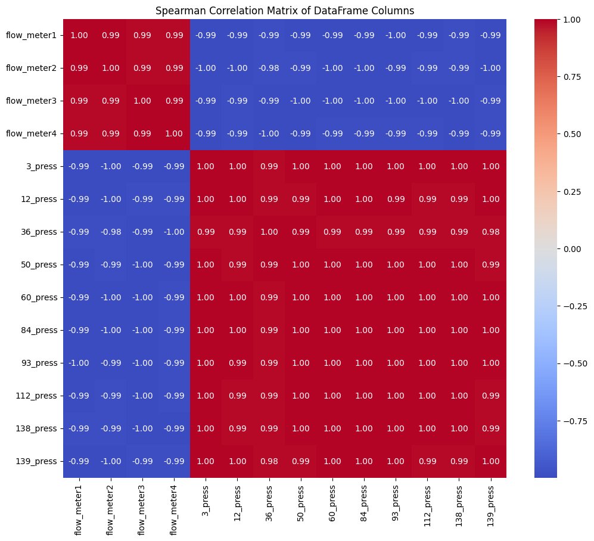
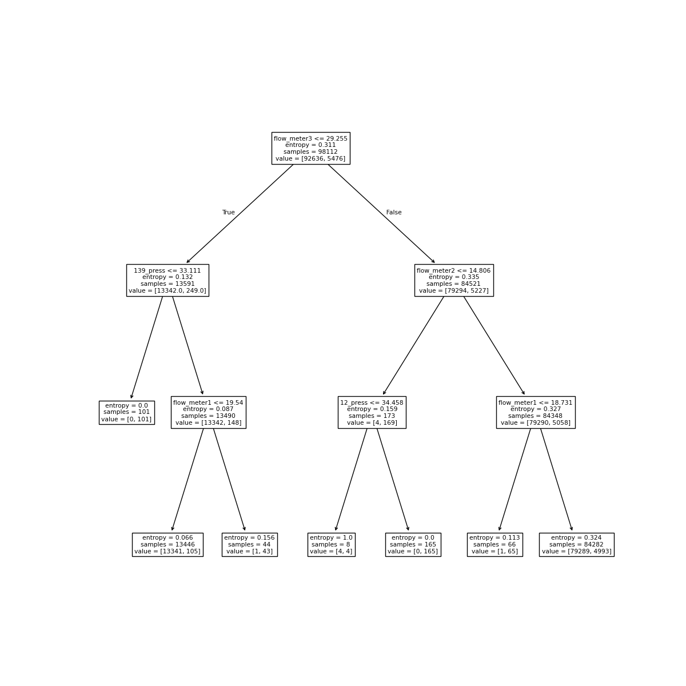

# Detailed Statistical and Machine Learning Analysis
**Authors:** Mateo H. Sanchez, Jose A. Calvetty, Milena R. de Sousa

**Dataset:** [Generated Datasets for Burst Detection in Water Distribution Systems](https://github.com/ArieleZanfei/generated-datasets-for-burst-detection-in-water-distribution-systems)

This document presents the complete source code used for the final project, organized into logical sections for clarity and professional review, designed to be executed in a Colab/Jupyter environment.

## 1. Environment Setup and Data Loading

### 1.1 Dependencies Installation and Core Imports
```python
!pip install scipy
# Import core data analysis and visualization libraries
import pandas as pd
import numpy as np
import scipy.stats as stats
import matplotlib.pyplot as plt
import seaborn as sns

import glob
import os
```
### 1.2 Library Imports and Configuration
All core, machine learning, and deep learning libraries are imported here.
```python
# Import Machine Learning libraries
import sklearn as skl
import sklearn.model_selection as skm
from ISLP import load_data, confusion_table
from ISLP.models import ModelSpec as MS
from sklearn.tree import (DecisionTreeClassifier as DTC,
                          DecisionTreeRegressor as DTR, # Incluida de tu código
                          plot_tree,
                          export_text)
from sklearn.metrics import (accuracy_score,
                             log_loss)
from sklearn.naive_bayes import GaussianNB
from sklearn.neural_network import MLPClassifier
from sklearn.ensemble import (RandomForestRegressor as RF, # Incluida de tu código
                              GradientBoostingRegressor as GBR) # Incluida de tu código
from ISLP.bart import BART # Incluida de tu código
from sklearn.model_selection import train_test_split # Importación explícita

# Import PyTorch and Deep Learning utilities
import torch
from torch import nn
import torch.nn as nn
from torch.optim import RMSprop
from torch.utils.data import TensorDataset, DataLoader
from torchmetrics import (MeanAbsoluteError, R2Score)
from torchinfo import summary
from pytorch_lightning import Trainer
from pytorch_lightning.loggers import CSVLogger
from pytorch_lightning import seed_everything # Used for reproducibility

# Set seed for reproducibility for PyTorch and Scikit-learn
seed_everything(42, workers=True)
torch.use_deterministic_algorithms(True, warn_only=True)
```
### 1.3 Data Loading and Merging
The initial datasets are loaded and merged into a single DataFrame (df_merged).
```python
# Define search pattern to find all CSV files recursively in subdirectories
search_pattern = os.path.join('**', '*.csv')
csv_files = glob.glob(search_pattern, recursive=True)

print(csv_files)

# Merge the first four CSV files into a single DataFrame
df_merged = pd.DataFrame()
for i in range(4):
    current_df = pd.read_csv(csv_files[i],sep=";")
    df_merged = pd.concat([df_merged, current_df], ignore_index=True)
```
## 2. Exploratory Data Analysis (EDA) and Statistical Tests
This part performs descriptive statistics, visualizes distributions, and conducts various parametric and non-parametric hypothesis tests on the sensor data.
### 2.1 Descrtiptive Statistics
Calculation of central tendency, dispersion, and shape measures for all sensor columns.
```python
# Create a copy for statistical analysis, dropping target and index columns
df_analy = df_merged.copy()
df_analy = df_analy.drop(columns=['burst','index'])

# Calculate basic descriptive statistics
df_stats = df_analy.describe()

# Calculate specific statistics not included in .describe()
mode = stats.mode(df_analy, keepdims=True)
var = df_analy.var()
std = df_analy.std()
sem = df_analy.sem()
skew = df_analy.skew()
kurtosis = df_analy.kurtosis()

# Format statistics into DataFrames for concatenation
mode = pd.DataFrame(mode.mode.reshape(1, -1), columns=df_analy.columns, index = ['mode']) # Most frequent value
var = pd.DataFrame(var.values.reshape(1, -1), columns=df_analy.columns, index = ['variance'])
std = pd.DataFrame(std.values.reshape(1, -1), columns=df_analy.columns, index = ['std'])
sem = pd.DataFrame(sem.values.reshape(1, -1), columns=df_analy.columns, index = ['sem'])
skew = pd.DataFrame(skew.values.reshape(1, -1), columns=df_analy.columns, index = ['skewness'])
kurtosis = pd.DataFrame(kurtosis.values.reshape(1, -1), columns=df_analy.columns, index = ['kurtosis'])

# Concatenate all statistics into one summary table
df_stats = pd.concat([df_stats, mode, var, std, sem, skew, kurtosis])
display(df_stats)
```
--- Descriptive Statistics Table (Markdown Format) ---
|          |    flow_meter1 |    flow_meter2 |   flow_meter3 |    flow_meter4 |         3_press |        12_press |        36_press |         50_press |        60_press |        84_press |        93_press |       112_press |       138_press |       139_press |
|:---------|---------------:|---------------:|--------------:|---------------:|----------------:|----------------:|----------------:|-----------------:|----------------:|----------------:|----------------:|----------------:|----------------:|----------------:|
| count    | 140160         | 140160         | 140160        | 140160         | 140160          | 140160          | 140160          | 140160           | 140160          | 140160          | 140160          | 140160          | 140160          | 140160          |
| mean     |     31.4583    |     32.4345    |     89.5173   |     27.7136    |     32.6305     |     32.134      |     35.9364     |     39.0964      |     33.6549     |     32.5922     |     31.5185     |     34.9086     |     35.163      |     31.3232     |
| std      |      8.9716    |     12.2473    |     41.6546   |      8.62795   |      2.07409    |      1.8892     |      2.50653    |      0.055288    |      2.57513    |      2.55157    |      2.50647    |      2.21456    |      2.07334    |      1.52728    |
| min      |     16.89      |     -2.0516    |     13.616    |     13.434     |     19.892      |     20.329      |     19.878      |     38.759       |     17.371      |     16.507      |     16.293      |     21.331      |     22.119      |     21.863      |
| 25%      |     22.733     |     20.7995    |     51.678    |     19.263     |     31.236      |     30.87       |     34.291      |     39.06        |     31.95       |     30.908      |     29.8498     |     33.457      |     33.795      |     30.302      |
| 50%      |     32.994     |     34.573     |     99.085    |     29.0545    |     32.628      |     32.129      |     35.935      |     39.096       |     33.651      |     32.588      |     31.454      |     34.883      |     35.16       |     31.332      |
| 75%      |     38.008     |     41.5203    |    120.53     |     34.151     |     34.68       |     34.009      |     38.374      |     39.15        |     36.184      |     35.096      |     33.988      |     37.077      |     37.192      |     32.815      |
| max      |     75.621     |    241.22      |    231.02     |     61.91      |     35.489      |     34.719      |     39.262      |     39.169       |     37.054      |     35.944      |     34.985      |     37.777      |     37.858      |     33.404      |
| mode     |     19.026     |     15.194     |    110.31     |     16.446     |     35.218      |     34.5        |     38.992      |     39.164       |     36.78       |     35.772      |     34.588      |     37.625      |     37.769      |     33.214      |
| var      |     80.4895    |    149.997     |   1735.1      |     74.4415    |      4.30185    |      3.56907    |      6.2827     |      0.00305676  |      6.63128    |      6.51052    |      6.28238    |      4.90427    |      4.29872    |      2.3326     |
| std      |      8.9716    |     12.2473    |     41.6546   |      8.62795   |      2.07409    |      1.8892     |      2.50653    |      0.055288    |      2.57513    |      2.55157    |      2.50647    |      2.21456    |      2.07334    |      1.52728    |
| sem      |      0.0239639 |      0.0327137 |      0.111263 |      0.023046  |      0.00554008 |      0.00504621 |      0.00669516 |      0.000147679 |      0.00687839 |      0.00681547 |      0.00669499 |      0.00591527 |      0.00553806 |      0.00407951 |
| skew     |     -0.0117617 |     -0.0284494 |     -0.230735 |     -0.0343642 |     -0.456349   |     -0.487605   |     -0.525518   |     -0.489277    |     -0.511187   |     -0.516275   |     -0.452406   |     -0.508267   |     -0.512303   |     -0.48636    |
| kurtosis |     -0.96428   |     -0.299599  |     -1.05591  |     -1.00815   |     -0.377178   |     -0.247688   |     -0.190024   |     -0.288931    |     -0.264105   |     -0.251045   |     -0.348022   |     -0.249646   |     -0.254266   |     -0.313507   |

### 2.2 Parametric Tests (T-tests and ANOVA)
Performing independent t-tests for pairwise comparisons and ANOVA for multiple group comparisons.
```python
# Define lists of 'flow_meter' and 'press' column names
flow_meter_cols = [col for col in df_analy.columns if 'flow_meter' in col]
press_cols = [col for col in df_analy.columns if '_press' in col]

# Convert the groups to lists of NumPy arrays for ANOVA
flow_meter_groups = [df_analy[col].values for col in flow_meter_cols]
press_groups = [df_analy[col].values for col in press_cols]

print("\n--- Independent T-tests between pairs of 'flow_meter' columns ---")
for i in range(len(flow_meter_cols)):
    for j in range(i + 1, len(flow_meter_cols)):
        col1 = flow_meter_cols[i]
        col2 = flow_meter_cols[j]
        ttest_result = stats.ttest_ind(df_analy[col1], df_analy[col2])
        print(f"T-test between {col1} and {col2}: {ttest_result}")

print("\n--- ANOVA Tests ---")
# Perform one-way ANOVA test on 'flow_meter' columns
anova_flow_meters = stats.f_oneway(*flow_meter_groups)
print(f"ANOVA test for 'flow_meter' columns: F-statistic: {anova_flow_meters.statistic}, P-value: {anova_flow_meters.pvalue}")

# Perform one-way ANOVA test on 'press' columns
anova_presses = stats.f_oneway(*press_groups)
print(f"ANOVA test for 'press' columns: F-statistic: {anova_presses.statistic}, P-value: {anova_presses.pvalue}")
```
```text
Independent t-tests between pairs of 'flow_meter' columns:
T-test between flow_meter1 and flow_meter2: TtestResult(statistic=np.float64(-24.07262472891008), pvalue=np.float64(6.532477176455693e-128), df=np.float64(280318.0))
T-test between flow_meter1 and flow_meter3: TtestResult(statistic=np.float64(-510.12016586640374), pvalue=np.float64(0.0), df=np.float64(280318.0))
T-test between flow_meter1 and flow_meter4: TtestResult(statistic=np.float64(112.63164267721473), pvalue=np.float64(0.0), df=np.float64(280318.0))
T-test between flow_meter2 and flow_meter3: TtestResult(statistic=np.float64(-492.2097857928514), pvalue=np.float64(0.0), df=np.float64(280318.0))
T-test between flow_meter2 and flow_meter4: TtestResult(statistic=np.float64(117.97431020888729), pvalue=np.float64(0.0), df=np.float64(280318.0))
T-test between flow_meter3 and flow_meter4: TtestResult(statistic=np.float64(543.928746301255), pvalue=np.float64(0.0), df=np.float64(280318.0))

Independent t-tests between pairs of 'press' columns:
T-test between 3_press and 12_press: TtestResult(statistic=np.float64(66.24865369400028), pvalue=np.float64(0.0), df=np.float64(280318.0))
T-test between 3_press and 36_press: TtestResult(statistic=np.float64(-380.4261480169346), pvalue=np.float64(0.0), df=np.float64(280318.0))
T-test between 3_press and 50_press: TtestResult(statistic=np.float64(-1166.7031109605657), pvalue=np.float64(0.0), df=np.float64(280318.0))
T-test between 3_press and 60_press: TtestResult(statistic=np.float64(-115.98736241780686), pvalue=np.float64(0.0), df=np.float64(280318.0))
T-test between 3_press and 84_press: TtestResult(statistic=np.float64(4.356498827275517), pvalue=np.float64(1.3220625473487372e-05), df=np.float64(280318.0))
T-test between 3_press and 93_press: TtestResult(statistic=np.float64(127.95744315401873), pvalue=np.float64(0.0), df=np.float64(280318.0))
T-test between 3_press and 112_press: TtestResult(statistic=np.float64(-281.0982798225494), pvalue=np.float64(0.0), df=np.float64(280318.0))
T-test between 3_press and 138_press: TtestResult(statistic=np.float64(-323.30498237752863), pvalue=np.float64(0.0), df=np.float64(280318.0))
T-test between 3_press and 139_press: TtestResult(statistic=np.float64(190.0015537761829), pvalue=np.float64(0.0), df=np.float64(280318.0))
T-test between 12_press and 36_press: TtestResult(statistic=np.float64(-453.53577856032075), pvalue=np.float64(0.0), df=np.float64(280318.0))
T-test between 12_press and 50_press: TtestResult(statistic=np.float64(-1379.1325825501578), pvalue=np.float64(0.0), df=np.float64(280318.0))
T-test between 12_press and 60_press: TtestResult(statistic=np.float64(-178.27588012925182), pvalue=np.float64(0.0), df=np.float64(280318.0))
T-test between 12_press and 84_press: TtestResult(statistic=np.float64(-54.030020655292866), pvalue=np.float64(0.0), df=np.float64(280318.0))
T-test between 12_press and 93_press: TtestResult(statistic=np.float64(73.41495591336735), pvalue=np.float64(0.0), df=np.float64(280318.0))
T-test between 12_press and 112_press: TtestResult(statistic=np.float64(-356.8514053233418), pvalue=np.float64(0.0), df=np.float64(280318.0))
T-test between 12_press and 138_press: TtestResult(statistic=np.float64(-404.2875628005277), pvalue=np.float64(0.0), df=np.float64(280318.0))
T-test between 12_press and 139_press: TtestResult(statistic=np.float64(124.94511729352874), pvalue=np.float64(0.0), df=np.float64(280318.0))
T-test between 36_press and 50_press: TtestResult(statistic=np.float64(-471.8649443258594), pvalue=np.float64(0.0), df=np.float64(280318.0))
T-test between 36_press and 60_press: TtestResult(statistic=np.float64(237.68891104587354), pvalue=np.float64(0.0), df=np.float64(280318.0))
T-test between 36_press and 84_press: TtestResult(statistic=np.float64(350.0373132524156), pvalue=np.float64(0.0), df=np.float64(280318.0))
T-test between 36_press and 93_press: TtestResult(statistic=np.float64(466.5986569591143), pvalue=np.float64(0.0), df=np.float64(280318.0))
T-test between 36_press and 112_press: TtestResult(statistic=np.float64(115.04149800700236), pvalue=np.float64(0.0), df=np.float64(280318.0))
T-test between 36_press and 138_press: TtestResult(statistic=np.float64(89.00558856804956), pvalue=np.float64(0.0), df=np.float64(280318.0))
T-test between 36_press and 139_press: TtestResult(statistic=np.float64(588.4028334794855), pvalue=np.float64(0.0), df=np.float64(280318.0))
T-test between 50_press and 60_press: TtestResult(statistic=np.float64(790.9211868798418), pvalue=np.float64(0.0), df=np.float64(280318.0))
T-test between 50_press and 84_press: TtestResult(statistic=np.float64(954.1021093720425), pvalue=np.float64(0.0), df=np.float64(280318.0))
T-test between 50_press and 93_press: TtestResult(statistic=np.float64(1131.5953348711228), pvalue=np.float64(0.0), df=np.float64(280318.0))
T-test between 50_press and 112_press: TtestResult(statistic=np.float64(707.7361522686425), pvalue=np.float64(0.0), df=np.float64(280318.0))
T-test between 50_press and 138_press: TtestResult(statistic=np.float64(709.9844475723189), pvalue=np.float64(0.0), df=np.float64(280318.0))
T-test between 50_press and 139_press: TtestResult(statistic=np.float64(1904.1623761842047), pvalue=np.float64(0.0), df=np.float64(280318.0))
T-test between 60_press and 84_press: TtestResult(statistic=np.float64(109.74421923750175), pvalue=np.float64(0.0), df=np.float64(280318.0))
T-test between 60_press and 93_press: TtestResult(statistic=np.float64(222.56627028063303), pvalue=np.float64(0.0), df=np.float64(280318.0))
T-test between 60_press and 112_press: TtestResult(statistic=np.float64(-138.19954001946604), pvalue=np.float64(0.0), df=np.float64(280318.0))
T-test between 60_press and 138_press: TtestResult(statistic=np.float64(-170.7873463564681), pvalue=np.float64(0.0), df=np.float64(280318.0))
T-test between 60_press and 139_press: TtestResult(statistic=np.float64(291.55588731955174), pvalue=np.float64(0.0), df=np.float64(280318.0))
T-test between 84_press and 93_press: TtestResult(statistic=np.float64(112.38354869593984), pvalue=np.float64(0.0), df=np.float64(280318.0))
T-test between 84_press and 112_press: TtestResult(statistic=np.float64(-256.6824811264855), pvalue=np.float64(0.0), df=np.float64(280318.0))
T-test between 84_press and 138_press: TtestResult(statistic=np.float64(-292.74593075995847), pvalue=np.float64(0.0), df=np.float64(280318.0))
T-test between 84_press and 139_press: TtestResult(statistic=np.float64(159.75510703485566), pvalue=np.float64(0.0), df=np.float64(280318.0))
T-test between 93_press and 112_press: TtestResult(statistic=np.float64(-379.4681629422728), pvalue=np.float64(0.0), df=np.float64(280318.0))
T-test between 93_press and 138_press: TtestResult(statistic=np.float64(-419.45765460856904), pvalue=np.float64(0.0), df=np.float64(280318.0))
T-test between 93_press and 139_press: TtestResult(statistic=np.float64(24.907203537628725), pvalue=np.float64(8.7674111254035e-137), df=np.float64(280318.0))
T-test between 112_press and 138_press: TtestResult(statistic=np.float64(-31.39831100119615), pvalue=np.float64(5.075241353653009e-216), df=np.float64(280318.0))
T-test between 112_press and 139_press: TtestResult(statistic=np.float64(498.9669160241004), pvalue=np.float64(0.0), df=np.float64(280318.0))
T-test between 138_press and 139_press: TtestResult(statistic=np.float64(558.2398853795611), pvalue=np.float64(0.0), df=np.float64(280318.0))
```
```text
ANOVA test for 'flow_meter' columns:
F-statistic: 240152.20061594024
P-value: 0.0

ANOVA test for 'press' columns:
F-statistic: 181474.47539419503
P-value: 0.0
```
### 2.3 Non-Parametric Tests (Normality, Homogeneity, Kruskal-Wallis)
Checking the assumptions for parametric tests and using Kruskal-Wallis as an alternative.
```python
print("\n--- Normality and Homogeneity Checks (Shapiro-Wilk and Levene) ---")
# Check normality for 'flow_meter' columns
print("Normality test (Shapiro-Wilk) for 'flow_meter' columns:")
for col in flow_meter_cols:
    shapiro_test = stats.shapiro(df_analy[col])
    print(f"Shapiro-Wilk test for {col}: {shapiro_test}")

# Check normality for 'press' columns
print("\nNormality test (Shapiro-Wilk) for 'press' columns:")
for col in press_cols:
    shapiro_test = stats.shapiro(df_analy[col])
    print(f"Shapiro-Wilk test for {col}: {shapiro_test}")

# Check homogeneity of variances for 'flow_meter' columns
print("\nHomogeneity of variances test (Levene) for 'flow_meter' columns:")
levene_flow_meters = stats.levene(*flow_meter_groups)
print(f"Levene test for 'flow_meter' columns: {levene_flow_meters}")

# Check homogeneity of variances for 'press' columns
print("\nHomogeneity of variances test (Levene) for 'press' columns:")
levene_presses = stats.levene(*press_groups)
print(f"Levene test for 'press' columns: {levene_presses}")

print("\n--- Kruskal-Wallis H-test ---")
# Perform Kruskal-Wallis test on 'flow_meter' columns
kruskal_flow_meters = stats.kruskal(*flow_meter_groups)
print(f"Kruskal-Wallis test for 'flow_meter' columns: Statistic: {kruskal_flow_meters.statistic}, P-value: {kruskal_flow_meters.pvalue}")

# Perform Kruskal-Wallis test on 'press' columns
kruskal_presses = stats.kruskal(*press_groups)
print(f"Kruskal-Wallis test for 'press' columns: Statistic: {kruskal_presses.statistic}, P-value: {kruskal_presses.pvalue}")
```
```text
Normality test (Shapiro-Wilk) for 'flow_meter' columns:
Shapiro-Wilk test for flow_meter1: ShapiroResult(statistic=np.float64(0.9493228975606264), pvalue=np.float64(4.9171084527515064e-101))
Shapiro-Wilk test for flow_meter2: ShapiroResult(statistic=np.float64(0.9478726513632699), pvalue=np.float64(8.99703303860943e-102))
Shapiro-Wilk test for flow_meter3: ShapiroResult(statistic=np.float64(0.9404495102073275), pvalue=np.float64(2.7342723606498036e-105))
Shapiro-Wilk test for flow_meter4: ShapiroResult(statistic=np.float64(0.9487620409763547), pvalue=np.float64(2.5369035572336675e-101))

Normality test (Shapiro-Wilk) for 'press' columns:
Shapiro-Wilk test for 3_press: ShapiroResult(statistic=np.float64(0.946357893014183), pvalue=np.float64(1.5939649288714802e-102))
Shapiro-Wilk test for 12_press: ShapiroResult(statistic=np.float64(0.9454502125805722), pvalue=np.float64(5.766148434067288e-103))
Shapiro-Wilk test for 36_press: ShapiroResult(statistic=np.float64(0.9425084201104278), pvalue=np.float64(2.3568159106545237e-104))
Shapiro-Wilk test for 50_press: ShapiroResult(statistic=np.float64(0.9418686068432865), pvalue=np.float64(1.1982244630685571e-104))
Shapiro-Wilk test for 60_press: ShapiroResult(statistic=np.float64(0.9402617296536535), pvalue=np.float64(2.253878248604768e-105))
Shapiro-Wilk test for 84_press: ShapiroResult(statistic=np.float64(0.9399330371865104), pvalue=np.float64(1.6091743734511091e-105))
Shapiro-Wilk test for 93_press: ShapiroResult(statistic=np.float64(0.9462561012594131), pvalue=np.float64(1.4211315099164976e-102))
Shapiro-Wilk test for 112_press: ShapiroResult(statistic=np.float64(0.9402854001259934), pvalue=np.float64(2.3093785778318252e-105))
Shapiro-Wilk test for 138_press: ShapiroResult(statistic=np.float64(0.9402604235224317), pvalue=np.float64(2.2508554313729875e-105))
Shapiro-Wilk test for 139_press: ShapiroResult(statistic=np.float64(0.944536100250562), pvalue=np.float64(2.1017266138332891e-103))

Homogeneity of variances test (Levene) for 'flow_meter' columns:
Levene test for 'flow_meter' columns: LeveneResult(statistic=np.float64(136660.87043572907), pvalue=np.float64(0.0))

Homogeneity of variances test (Levene) for 'press' columns:
Levene test for 'press' columns: LeveneResult(statistic=np.float64(39350.37973802515), pvalue=np.float64(0.0))
/usr/local/lib/python3.12/dist-packages/scipy/stats/_axis_nan_policy.py:579: UserWarning: scipy.stats.shapiro: For N > 5000, computed p-value may not be accurate. Current N is 140160.
  res = hypotest_fun_out(*samples, **kwds)
```
```text
Kruskal-Wallis test for 'flow_meter' columns:
Kruskal-Wallis statistic: 183729.10612872834
P-value: 0.0

Kruskal-Wallis test for 'press' columns:
Kruskal-Wallis statistic: 714818.3031763351
P-value: 0.0
```
### 2.4 Non-parametric Tests (Mann-Whitney U)
Using Mann-Whitney U tests for pairwise comparisons when Kruskal-Wallis is significant.
```python
# Perform Mann-Whitney U tests between pairs of 'flow_meter' columns
print("\nMann-Whitney U tests between pairs of 'flow_meter' columns:")
for i in range(len(flow_meter_cols)):
    for j in range(i + 1, len(flow_meter_cols)):
        col1 = flow_meter_cols[i]
        col2 = flow_meter_cols[j]
        mannwhitneyu_result = stats.mannwhitneyu(df_analy[col1], df_analy[col2])
        print(f"Mann-Whitney U test between {col1} and {col2}: {mannwhitneyu_result}")

# Perform Mann-Whitney U tests between pairs of 'press' columns
print("\nMann-Whitney U tests between pairs of 'press' columns:")
for i in range(len(press_cols)):
    for j in range(i + 1, len(press_cols)):
        col1 = press_cols[i]
        col2 = press_cols[j]
        mannwhitneyu_result = stats.mannwhitneyu(df_analy[col1], df_analy[col2])
        print(f"Mann-Whitney U test between {col1} and {col2}: {mannwhitneyu_result}")
```
```text
Mann-Whitney U tests between pairs of 'flow_meter' columns:
Mann-Whitney U test between flow_meter1 and flow_meter2: MannwhitneyuResult(statistic=np.float64(9286826115.0), pvalue=np.float64(5.867493672775926e-138))
Mann-Whitney U test between flow_meter1 and flow_meter3: MannwhitneyuResult(statistic=np.float64(2689480268.5), pvalue=np.float64(0.0))
Mann-Whitney U test between flow_meter1 and flow_meter4: MannwhitneyuResult(statistic=np.float64(12302332901.0), pvalue=np.float64(0.0))
Mann-Whitney U test between flow_meter2 and flow_meter3: MannwhitneyuResult(statistic=np.float64(2797445947.5), pvalue=np.float64(0.0))
Mann-Whitney U test between flow_meter2 and flow_meter4: MannwhitneyuResult(statistic=np.float64(12217371670.5), pvalue=np.float64(0.0))
Mann-Whitney U test between flow_meter3 and flow_meter4: MannwhitneyuResult(statistic=np.float64(17448646105.0), pvalue=np.float64(0.0))

Mann-Whitney U tests between pairs of 'press' columns:
Mann-Whitney U test between 3_press and 12_press: MannwhitneyuResult(statistic=np.float64(11440737079.5), pvalue=np.float64(0.0))
Mann-Whitney U test between 3_press and 36_press: MannwhitneyuResult(statistic=np.float64(3160811819.5), pvalue=np.float64(0.0))
Mann-Whitney U test between 3_press and 50_press: MannwhitneyuResult(statistic=np.float64(0.0), pvalue=np.float64(0.0))
Mann-Whitney U test between 3_press and 60_press: MannwhitneyuResult(statistic=np.float64(7280732240.5), pvalue=np.float64(0.0))
Mann-Whitney U test between 3_press and 84_press: MannwhitneyuResult(statistic=np.float64(9466201202.0), pvalue=np.float64(4.350511392349533e-62))
Mann-Whitney U test between 3_press and 93_press: MannwhitneyuResult(statistic=np.float64(12540905752.0), pvalue=np.float64(0.0))
Mann-Whitney U test between 3_press and 112_press: MannwhitneyuResult(statistic=np.float64(4657881152.5), pvalue=np.float64(0.0))
Mann-Whitney U test between 3_press and 138_press: MannwhitneyuResult(statistic=np.float64(4023256355.5), pvalue=np.float64(0.0))
Mann-Whitney U test between 3_press and 139_press: MannwhitneyuResult(statistic=np.float64(13532269223.5), pvalue=np.float64(0.0))
Mann-Whitney U test between 12_press and 36_press: MannwhitneyuResult(statistic=np.float64(2282433199.0), pvalue=np.float64(0.0))
Mann-Whitney U test between 12_press and 50_press: MannwhitneyuResult(statistic=np.float64(0.0), pvalue=np.float64(0.0))
Mann-Whitney U test between 12_press and 60_press: MannwhitneyuResult(statistic=np.float64(6277447430.0), pvalue=np.float64(0.0))
Mann-Whitney U test between 12_press and 84_press: MannwhitneyuResult(statistic=np.float64(8368813478.0), pvalue=np.float64(0.0))
Mann-Whitney U test between 12_press and 93_press: MannwhitneyuResult(statistic=np.float64(10921125670.5), pvalue=np.float64(0.0))
Mann-Whitney U test between 12_press and 112_press: MannwhitneyuResult(statistic=np.float64(3501198295.5), pvalue=np.float64(0.0))
Mann-Whitney U test between 12_press and 138_press: MannwhitneyuResult(statistic=np.float64(2863681338.5), pvalue=np.float64(0.0))
Mann-Whitney U test between 12_press and 139_press: MannwhitneyuResult(statistic=np.float64(12485608351.5), pvalue=np.float64(0.0))
Mann-Whitney U test between 36_press and 50_press: MannwhitneyuResult(statistic=np.float64(1153984984.5), pvalue=np.float64(0.0))
Mann-Whitney U test between 36_press and 60_press: MannwhitneyuResult(statistic=np.float64(14316349494.0), pvalue=np.float64(0.0))
Mann-Whitney U test between 36_press and 84_press: MannwhitneyuResult(statistic=np.float64(16023508198.0), pvalue=np.float64(0.0))
Mann-Whitney U test between 36_press and 93_press: MannwhitneyuResult(statistic=np.float64(17533257645.5), pvalue=np.float64(0.0))
Mann-Whitney U test between 36_press and 112_press: MannwhitneyuResult(statistic=np.float64(12371959199.0), pvalue=np.float64(0.0))
Mann-Whitney U test between 36_press and 138_press: MannwhitneyuResult(statistic=np.float64(11911220002.5), pvalue=np.float64(0.0))
Mann-Whitney U test between 36_press and 139_press: MannwhitneyuResult(statistic=np.float64(18410570123.5), pvalue=np.float64(0.0))
Mann-Whitney U test between 50_press and 60_press: MannwhitneyuResult(statistic=np.float64(19644825600.0), pvalue=np.float64(0.0))
Mann-Whitney U test between 50_press and 84_press: MannwhitneyuResult(statistic=np.float64(19644825600.0), pvalue=np.float64(0.0))
Mann-Whitney U test between 50_press and 93_press: MannwhitneyuResult(statistic=np.float64(19644825600.0), pvalue=np.float64(0.0))
Mann-Whitney U test between 50_press and 112_press: MannwhitneyuResult(statistic=np.float64(19644825600.0), pvalue=np.float64(0.0))
Mann-Whitney U test between 50_press and 138_press: MannwhitneyuResult(statistic=np.float64(19644825600.0), pvalue=np.float64(0.0))
Mann-Whitney U test between 50_press and 139_press: MannwhitneyuResult(statistic=np.float64(19644825600.0), pvalue=np.float64(0.0))
Mann-Whitney U test between 60_press and 84_press: MannwhitneyuResult(statistic=np.float64(12281445532.0), pvalue=np.float64(0.0))
Mann-Whitney U test between 60_press and 93_press: MannwhitneyuResult(statistic=np.float64(14108920678.0), pvalue=np.float64(0.0))
Mann-Whitney U test between 60_press and 112_press: MannwhitneyuResult(statistic=np.float64(6881723445.5), pvalue=np.float64(0.0))
Mann-Whitney U test between 60_press and 138_press: MannwhitneyuResult(statistic=np.float64(6336216131.5), pvalue=np.float64(0.0))
Mann-Whitney U test between 60_press and 139_press: MannwhitneyuResult(statistic=np.float64(15244915056.5), pvalue=np.float64(0.0))
Mann-Whitney U test between 84_press and 93_press: MannwhitneyuResult(statistic=np.float64(12358277065.5), pvalue=np.float64(0.0))
Mann-Whitney U test between 84_press and 112_press: MannwhitneyuResult(statistic=np.float64(5047167831.5), pvalue=np.float64(0.0))
Mann-Whitney U test between 84_press and 138_press: MannwhitneyuResult(statistic=np.float64(4528643839.5), pvalue=np.float64(0.0))
Mann-Whitney U test between 84_press and 139_press: MannwhitneyuResult(statistic=np.float64(13037704041.0), pvalue=np.float64(0.0))
Mann-Whitney U test between 93_press and 112_press: MannwhitneyuResult(statistic=np.float64(3250786903.5), pvalue=np.float64(0.0))
Mann-Whitney U test between 93_press and 138_press: MannwhitneyuResult(statistic=np.float64(2709445872.5), pvalue=np.float64(0.0))
Mann-Whitney U test between 93_press and 139_press: MannwhitneyuResult(statistic=np.float64(10612740477.0), pvalue=np.float64(5.94744152632351e-298))
Mann-Whitney U test between 112_press and 138_press: MannwhitneyuResult(statistic=np.float64(9014115633.0), pvalue=np.float64(0.0))
Mann-Whitney U test between 112_press and 139_press: MannwhitneyuResult(statistic=np.float64(17777067066.0), pvalue=np.float64(0.0))
Mann-Whitney U test between 138_press and 139_press: MannwhitneyuResult(statistic=np.float64(18242678766.5), pvalue=np.float64(0.0))
```
### 2.5 Correlation and Distribution Analysis
Calculating and visualizing the Pearson and Spearman correlation matrices, and the probability distributions.
```python
# Calculate and visualize the Pearson correlation matrix
correlation_matrix = df_analy.corr()
plt.figure(figsize=(12, 10))
sns.heatmap(correlation_matrix, annot=True, cmap='coolwarm', fmt=".2f")
plt.title('Pearson Correlation Matrix of DataFrame Columns')
plt.show()

# Calculate and visualize the Spearman correlation matrix
spearman_correlation_matrix = df_analy.corr(method='spearman')
plt.figure(figsize=(12, 10))
sns.heatmap(spearman_correlation_matrix, annot=True, cmap='coolwarm', fmt=".2f")
plt.title('Spearman Correlation Matrix of DataFrame Columns')
plt.show()

# Visualize the probability distribution of each column (Histograms)
for col in df_analy.columns:
    plt.figure(figsize=(8, 6))
    sns.histplot(df_analy[col], kde=True)
    plt.title(f'Distribution of {col}')
    plt.xlabel(col)
    plt.ylabel('Frequency')
    plt.show()
```


## Summary:

### Key Findings

* Independent t-tests between pairs of 'flow_meter' columns and pairs of 'press' columns showed statistically significant differences between the means of most column pairs, with many p-values close to 0.
* ANOVA tests for both 'flow_meter' and 'press' columns resulted in high F-statistics and p-values of 0.0, indicating statistically significant differences in the means among the groups within each category.
* Assumptions for ANOVA (normality and homogeneity of variances) were violated for both 'flow_meter' and 'press' columns based on Shapiro-Wilk tests (low p-values) and Levene's tests (p-values of 0.0).
* Kruskal-Wallis tests, used as non-parametric alternatives due to ANOVA assumption violations, produced large test statistics and p-values of 0.0 for both 'flow_meter' and 'press' columns, confirming statistically significant differences in median values among the groups.
* A correlation matrix was calculated and visualized, showing the pairwise correlations between all columns in the DataFrame.
* Histograms with kernel density estimates were generated for each column, providing a visual representation of their probability distributions.

## 3 Machine Learning Classification Models
This section implements and evaluates three different classification approaches to predict the burst target variable.
### 3.1 Decision Tree Classification (DTC)
Implementation, evaluation, and pruning of a Decision Tree Classifier.
```python
# Prepare data for modeling
model = MS(df_merged.columns.drop(['index','burst']), intercept=False)
D = model.fit_transform(df_merged)
feature_names = list(D.columns)
X = np.asarray(D)
y = df_merged['burst']

# Split data into training and testing sets (random_state=42)
(X_train,
X_test,
y_train,
y_test) = skm.train_test_split(X,
                               y,
                               test_size=0.3,
                               random_state=42)

# Train the initial classifier (max_depth=3)
classificador = DTC(criterion='entropy',
                    max_depth=3,
                    random_state=0)

print(f"X shape: {X.shape}")
print(f"y_train shape: {y_train.shape}")

classificador.fit(X_train, y_train)

# Evaluation metrics
print(f"Initial Test Accuracy: {accuracy_score(y_test, classificador.predict(X_test))}")
resid_dev = np.sum(log_loss(y_test, classificador.predict_proba(X_test)))
print(f"Initial Log Loss: {resid_dev}")

# Visualize the initial tree
plt.figure(figsize=(12,12))
plot_tree(classificador,
          feature_names=feature_names,
          filled=True)
plt.title("Initial Decision Tree (Max Depth 3)")
plt.show()

# Print text representation
print("\n--- Initial Decision Tree Text Summary ---")
print(export_text(classificador,
                  feature_names=feature_names,
                  show_weights=True))

# Cross-Validation
validation = skm.ShuffleSplit(n_splits=4,
                              test_size=100,
                              random_state=0)
results = skm.cross_validate(classificador,
                             X_train,
                             y_train,
                             cv=validation)
print(f"\nCross-Validation Scores: {results['test_score']}")

# Confusion matrix 
confusion_matrix = confusion_table(classificador.predict(X),df_merged['burst'])
print(confusion_matrix)

# Cost-Complexity Pruning (CCP) and Grid Search
clf = DTC(criterion='entropy', random_state=0)
ccp_path = classificador.cost_complexity_pruning_path(X_train, y_train)
kfold = skm.KFold(10, random_state=1, shuffle=True)

grid = skm.GridSearchCV(clf,
                        {'ccp_alpha': ccp_path.ccp_alphas},
                        refit=True,
                        cv=kfold,
                        scoring='accuracy')
grid.fit(X_train, y_train)
print(grid.best_score_)

# Visualize the Pruned Decision Tree
ax = subplots(figsize=(12, 12))[1]
best_ = grid.best_estimator_
plot_tree(best_,
          feature_names=feature_names,
          ax=ax);

# Final evaluation of the best (pruned) tree
print(best_.tree_.n_leaves)

print(accuracy_score(y_test,
                      best_.predict(X_test)))
confusion = confusion_table(best_.predict(X_test),
                            y_test)
print(confusion)
```
```text
Data Shape after Splitting:
(140160, 14)
(98112,)

Initial Test Accuracy:
0.9488441780821918

Residual Deviance (Log Loss):
0.19974997711808481
```
Initial Desicion Tree Visualization

```text
Decision Tree Logic (Text Export)
|--- flow_meter3 <= 29.26
|   |--- 139_press <= 33.11
|   |   |--- weights: [0.00, 101.00] class: 1.0
|   |--- 139_press >  33.11
|   |   |--- flow_meter1 <= 19.54
|   |   |   |--- weights: [13341.00, 105.00] class: 0.0
|   |   |--- flow_meter1 >  19.54
|   |   |   |--- weights: [1.00, 43.00] class: 1.0
|--- flow_meter3 >  29.26
|   |--- flow_meter2 <= 14.81
|   |   |--- 12_press <= 34.46
|   |   |   |--- weights: [4.00, 4.00] class: 0.0
|   |   |--- 12_press >  34.46
|   |   |   |--- weights: [0.00, 165.00] class: 1.0
|   |--- flow_meter2 >  14.81
|   |   |--- flow_meter1 <= 18.73
|   |   |   |--- weights: [1.00, 65.00] class: 1.0
|   |   |--- flow_meter1 >  18.73
|   |   |   |--- weights: [79289.00, 4993.00] class: 0.0
```
```text
Initial Cross-Validation Scores
array([0.93, 0.94, 0.92, 0.92])

Confusion MAtrix (Full Dataset)
Truth         0.0   1.0
Predicted              
0.0        132406  7250
1.0             5   499

Accuracy Score (clf - Unpruned Tree)
0.9732448630136986

Best Cross-Validation Score (After Pruning)
0.9723886884040699
```
### 3.2 Naive Bayes Classification (Gaussian)
Implementation and evaluation of the Gaussian Naive Bayes model.
```python
model = MS(df_merged.columns.drop(['index','burst']), intercept=False)
D = model.fit_transform(df_merged) # Process features with ModelSpec
feature_names = list(D.columns)
X = np.asarray(D)
# Data split (random_state=0)
(X_train,
X_test,
y_train,
y_test) = skm.train_test_split(X,
df_merged['burst'],
test_size=0.3,
random_state=0) # Note: Split uses a different random_state than DTC section

gnb = GaussianNB()
model_gnb = gnb.fit(X_train, y_train)

# Inspect parameters and make predictions
display(model_gnb.classes_) # Display classes

display(model_gnb.class_prior_) # Display prior probabilities

display(model_gnb.theta_) # Display feature means (parameters)
display(model_gnb.var_) # Display feature variances (parameters)

display(X_train[y_train == 0].mean(axis=0)) # Mean value for Class 0 features
display(X_train[y_train == 0].var(ddof=0, axis=0)) # Variance value for Class 0 features

y_pred = model_gnb.predict(X_test) # Predicted values

print(accuracy_score(y_test,
                     y_pred))
display(confusion_table(y_pred, y_test)) # Confusion table
# Print the number of mislabeled points out of a total
miss_points = (X_test.shape[0], (y_test != y_pred).sum())
print("Mislabeled points out of a total %d points : %d" % miss_points)

y_pred_prob = model_gnb.predict_proba(X_test)[:10]
display(y_pred_prob) # Probability that each observation belongs to a particular class
```
### 3.3 Neural Networks (Scikit-learn MLP Classifier)
```python
# Convert NumPy arrays to PyTorch tensors
X_train_tensor = torch.tensor(X_train, dtype=torch.float32)
y_train_tensor = torch.tensor(y_train.values, dtype=torch.float32).unsqueeze(1) # Add an extra dimension for binary output
X_test_tensor = torch.tensor(X_test, dtype=torch.float32)
y_test_tensor = torch.tensor(y_test.values, dtype=torch.float32).unsqueeze(1) # Add an extra dimension for binary output

# Create TensorDataset
train_dataset = TensorDataset(X_train_tensor, y_train_tensor)
test_dataset = TensorDataset(X_test_tensor, y_test_tensor)

# Create DataLoader
batch_size = 64 # You can adjust this batch size
train_loader = DataLoader(train_dataset, batch_size=batch_size, shuffle=True)
test_loader = DataLoader(test_dataset, batch_size=batch_size, shuffle=False)

print("Data prepared for PyTorch model.")

print(X_train_tensor.shape)


# model
MLPmodel = MLPClassifier(solver='sgd',
                         learning_rate_init=1e-4,
                         max_iter=100,
                         shuffle=True,
                         tol = 1e-8,
                         hidden_layer_sizes=(100,100),
                         alpha=1e-4,
                         random_state=42)
# training process
MLPmodel.fit(X_train_tensor,y_train_tensor.ravel()) # Use ravel() to flatten y_train for MLPClassifier

# prediction
y_predict = MLPmodel.predict(X_test_tensor)

# print(f'Model Coefficients: {MLPmodel.coefs_}') # Coefficients (commented out in original)

# print(f'Model Biases: {MLPmodel.intercepts_}') # Biases (commented out in original)

# predict probability
prob = MLPmodel.predict_proba(X_test_tensor)

print(f'Model Probabilities (first 5):\n{prob[:5]}')

print(MLPmodel.score(X_test_tensor,y_test_tensor.ravel()))

print(accuracy_score(y_test_tensor,
                     y_predict))
display(confusion_table(y_predict, y_test_tensor.ravel())) # Confusion table

sns.heatmap(confusion_table(y_predict, y_test_tensor.ravel()),
        annot=True,cmap = 'RdYlBu')
plt.show()
```
3.4 PyTorch Custom CNN-LSTM Model
```python
# Convert NumPy arrays to PyTorch tensors
X_train_tensor = torch.tensor(X_train, dtype=torch.float32)
y_train_tensor = torch.tensor(y_train.values, dtype=torch.long) # Use dtype=torch.long for CrossEntropyLoss
X_test_tensor = torch.tensor(X_test, dtype=torch.float32)
y_test_tensor = torch.tensor(y_test.values, dtype=torch.long) # Use dtype=torch.long for CrossEntropyLoss

# Create TensorDataset
train_dataset = TensorDataset(X_train_tensor, y_train_tensor)
test_dataset = TensorDataset(X_test_tensor, y_test_tensor)

# Create DataLoader
batch_size = 64 # You can adjust this batch size
train_loader = DataLoader(train_dataset, batch_size=batch_size, shuffle=True)
test_loader = DataLoader(test_dataset, batch_size=batch_size, shuffle=False)

print("Data prepared for PyTorch model.")

class LeakDetectionModel(nn.Module):
    def __init__(self,
                 input_dim=14,        # Number of features
                 window_size=60,      # Timesteps per sample (Sequence Length)
                 cnn_channels=[32, 64],
                 lstm_hidden=128,
                 lstm_layers=2,
                 dropout=0.3,
                 num_classes=2):      # 2 classes: no burst / burst
        super().__init__()

        cnn_layers = []
        in_channels = input_dim

        # Automatic Convolutional Blocks
        for out_channels in cnn_channels:
            cnn_layers.append(nn.Conv1d(in_channels, out_channels, kernel_size=3, padding=1))
            cnn_layers.append(nn.BatchNorm1d(out_channels))
            cnn_layers.append(nn.ReLU())
            cnn_layers.append(nn.Dropout(dropout))
            in_channels = out_channels

        self.cnn = nn.Sequential(*cnn_layers)

        # LSTM for CNN-processed sequence
        self.lstm = nn.LSTM(input_size=cnn_channels[-1],
                             hidden_size=lstm_hidden,
                             num_layers=lstm_layers,
                             batch_first=True,
                             dropout=dropout)

        # Final Classifier
        self.fc = nn.Sequential(
            nn.Linear(lstm_hidden, 64),
            nn.ReLU(),
            nn.Dropout(dropout),
            nn.Linear(64, num_classes)
        )

    def forward(self, x):
        # Expected Input: (batch, seq_len, features)
        # If input is 2D (batch, features), add seq_len dimension
        if x.dim() == 2:
            x = x.unsqueeze(1) # (batch, 1, features)

        # Now input is (batch, seq_len, features)
        x = x.permute(0, 2, 1)    # (batch, features, seq_len) for CNN
        x = self.cnn(x)
        x = x.permute(0, 2, 1)    # (batch, seq_len, channels) for LSTM
        _, (h_n, _) = self.lstm(x)
        out = self.fc(h_n[-1])
        return out

model = LeakDetectionModel(
    input_dim=14,
    window_size=60,
    cnn_channels=[32, 64],
    lstm_hidden=128,
    lstm_layers=2,
    dropout=0.3,
    num_classes=2
)

print(model)

# Create a dummy tensor with the same batch size as X_train_tensor and shape (batch_size, 1, features)
x = X_train_tensor
y = model(x)
print(y.shape)

criterion = nn.CrossEntropyLoss()
optimizer = torch.optim.Adam(model.parameters(), lr=1e-3)

epochs = 5 # Define the number of training epochs

for epoch in range(epochs):
    optimizer.zero_grad()
    # Convert X_train to a PyTorch tensor before passing to the model
    outputs = model(X_train_tensor)
    loss = criterion(outputs, y_train_tensor)
    loss.backward()
    optimizer.step()
```
